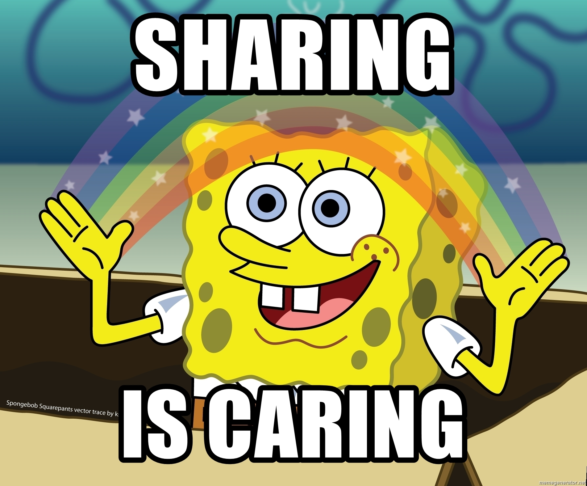

Good morning, afternoon, or evening to whenever and wherever you are. My name is Martin Strnad, I'm a junior security systems engineer and this is a Hello World type of post. I live in the Czech Republic, not far from our main city Prague in a small, lovely village.

I’ve been on this planet for almost a quarter of a century and in my quest to become a more effective, all-rounded individual, I decided to start a blog/rant page. The goal of this thing is to let the world know that I exist and to keep me accountable. Let me explain.

A wise man once said: 
> “You never really know something until you teach it to someone else.” John C. Maxwell

When we learn something, most of us learn it in bits and pieces. Information we read and consume is most likely structured sensibly – like a book, video, podcast, etc. But when we consume it, the material doesn’t go into our heads in the same way. Instead, you absorb information in jumbled bits and pieces.

The process of putting my thoughts on paper will force me to reorganize them, sort them out and make sense of them. So, when you try to teach something to someone else, you must go through this process in your mind.

And that’s what the goal of this blog is. Not only to teach people something but to let me put my ideas and thoughts onto paper and organize them. Once organized, I might post them and share them with others as well.

To keep me accountable, I’ll set a post frequency in a later post, that I’ll try to keep going with. In that post, I’ll also state what you can expect from posts on this site and what to look forward to. 

Until then, you have a wonderful day.