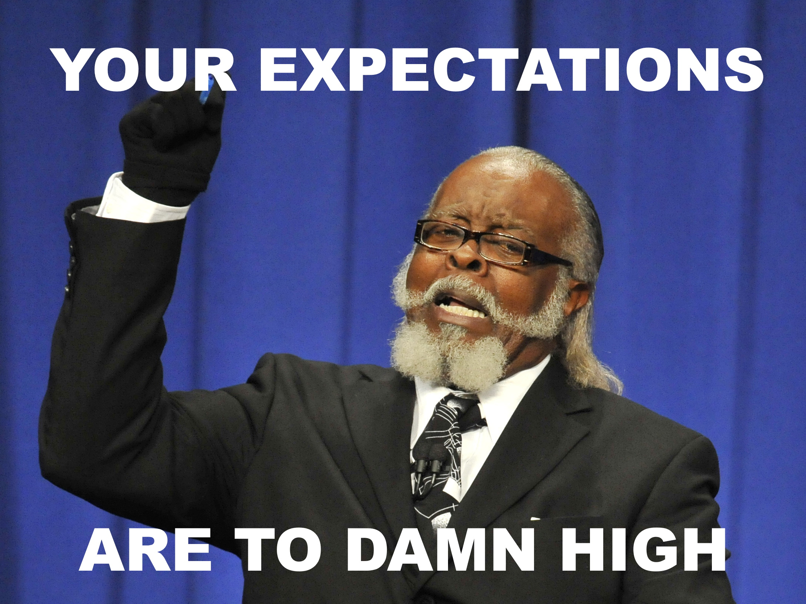

> ## TL; DR
> I'm an IT guy. I'll write about productivity, time management stuff, do some book reviews, post about restoration process on things I do in my free time and finally, I'll share development process of this website. This blog is here to keep me accountable.

As I said in last post, todays post is all about what you can expect from me and this blog. I'll mention what the content of this blog would look like and how would I keep myself accountable.

I've been thinking about how frequently I want to post and I figured, that due to my work and free time balance, once in two weeks would be ideal. To make a schedule for you and myself to rely on, I'll be posting once every two weeks on Saturday. I'll try my hardest to keep on going.

In my first post, I said that one of goals for this blog is to keep myself accountable. So, to keep myself accountable, I have to stick to this schedule. If I don't, please, tweet @strnad10 and ask me for 5 USD. First 5 of you who tweet before next post is posted will receive them. This is not from my own head. If I remember correctly, James Clear wrote about a guy who wanted to wake up earlier but couldn't hold his word. He made a promise to his audience that he would tweet every day at said hour right after he wakes up. When he does not tweet at that time, first five people to tweet at him would receive 5 bucks. James Clear calls this __an Accountability Contract__. I think that this is a brilliant way to keep myself on track.

### What I'm interested about
Recently in my work environment, I stumbled across a personality test, which fascinated me. I took the test at 16personalities.com and it's free so go ahead and try it. If you are interested in locating your strengths and weaknesses and working on yourself, this is a nice place to start. That said, from time to time, I'll post something about my personality type, all other personality types and tips and tricks related to them.

Since I mentioned my work environment, I might as well tell you, what I do. I'm an IT systems engineer in a security focused company and I mainly work with Microsoft 365 products and services. I'll try to post about things I do a lot.

I really like improving my workflow and I also like to do things as best as I can. That said, I'm heavily interested in productivity, effectiveness and self-development so stay tuned for some of that good stuff.

Book review or my view on it is one type of posts you will find here. I'll share my opinion and main key ideas, how the book impacted me and my rating of the book. I'm interested in productivity stuff, boosting my effectiveness, better time management so you will also see some of that.

Outside of work, I do stuff from wood, metal, and other materials and most importantly, I like to restore and renew old things (like a bike from 1979 or my house). So, look forward to some of my work. 🙂

Last, but not least, I'll share with you all the process of creating this blog. As you might have noticed, this blog is based on Gatsby framework and its default blog template. I already customized it a bit. I developed tags which I can assign to each post. I'll be improving my blog from time to time. Next thing I really want to add is some sort of table of content to get you around the post faster using Anchor links and custom React component. Bear in mind that I'm fairly new to programming in JavaScript so don't be harsh. 😁
