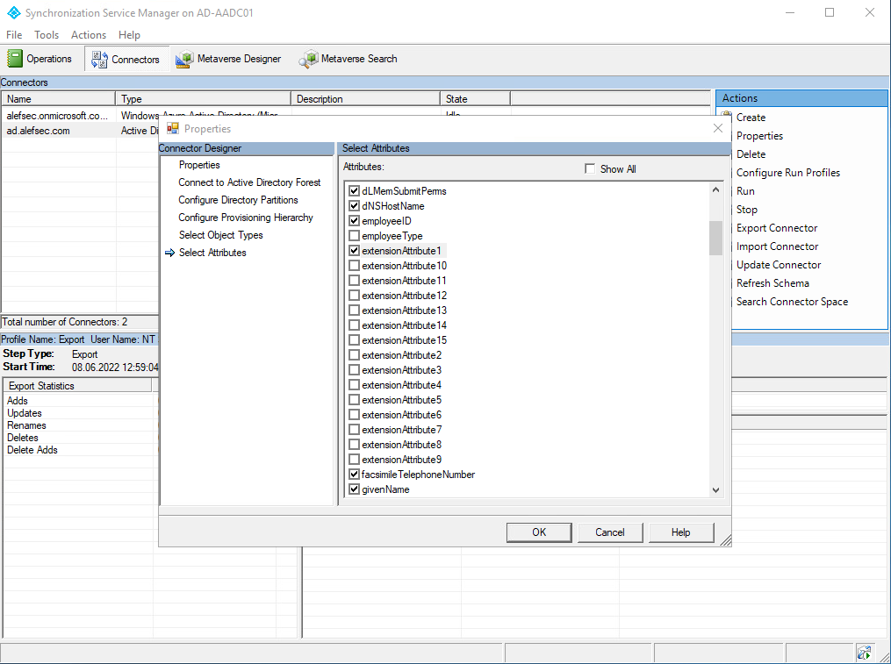
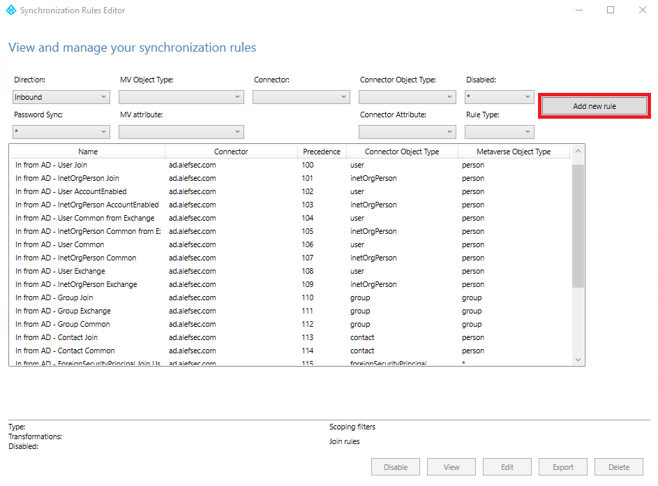
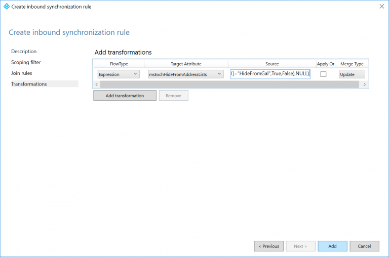
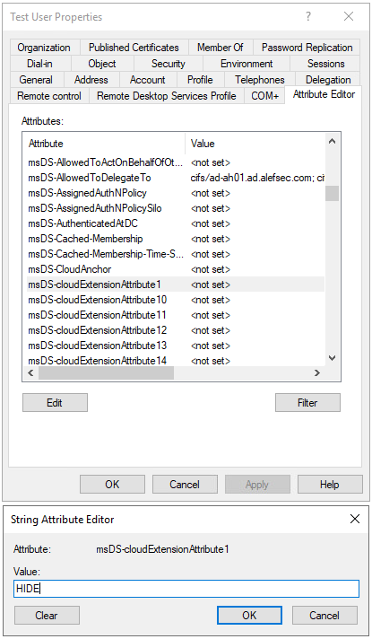
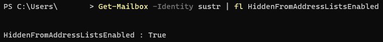
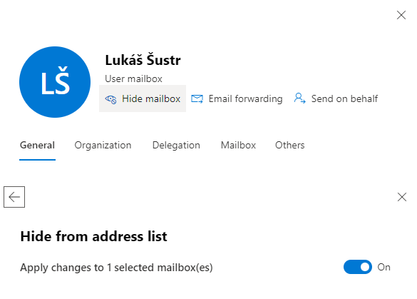
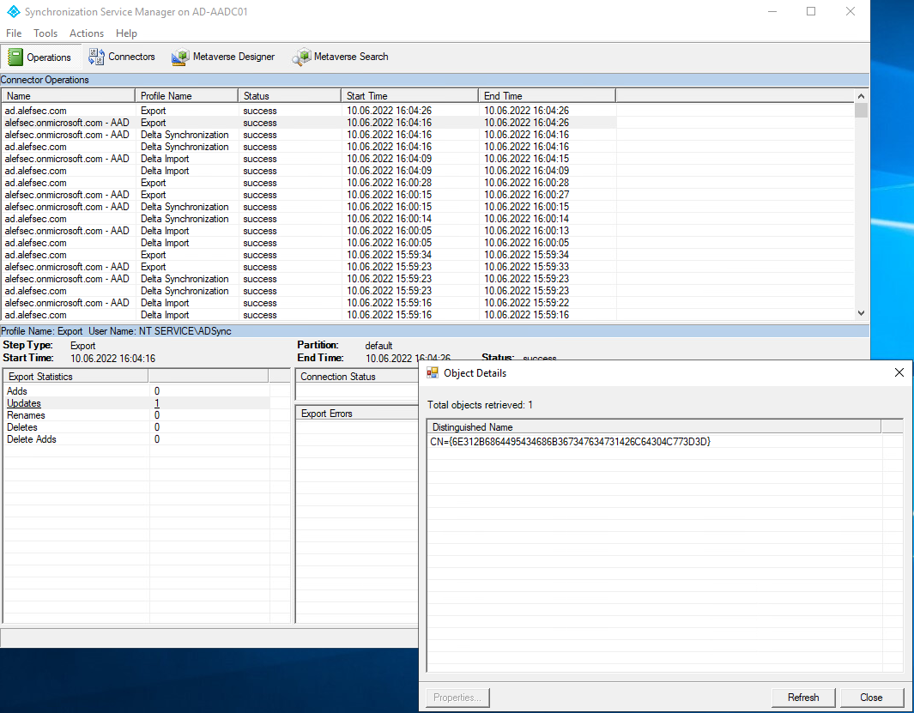
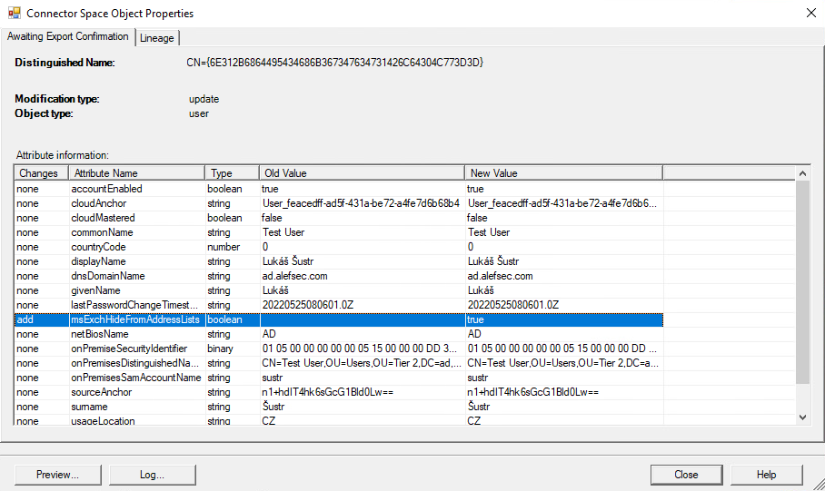

## TL;DR

> This post will go over how to sync a custom attribute from on-premises Active Directory to Azure Active Directory to hide a user from the GAL, without the need of extending your Active Directory schema.

## Problem we had

Few days ago, I had a chance to troubleshoot an interesting problem that my customer had. To understand what happened, here's a background of their infrastructure. They had an Active Directory Domain Services and an Exchange Server 2016. Pretty standard infrastructure for small business to say the least. Then they decided to move to Microsoft 365 2 years ago and decommission Exchange Server. 

After a while, their AD DS got a bit messy and so they decided to build new AD DS and this time implement it properly like it should be - use Tiering Model. Still with me? Mkay. After the implementation of new AD DS, it was my time to shine. I had to install new Azure Active Directory Connect and pair all new on-premises identities with old identities in Microsoft 365.

Now to get to the problem they had. When you use Exchange Server, your Active Directory gets extended by tons of __msExch\*__ attributes including __msExchHideFromAddressLists__. This attribute is there to hide user from Global Address List. They used this attribute to hide some mailboxes. HOWEVER, when you decommission Exchange server and reimplement Domain Services, that attribute is gone. *POOF!* You don't see it in new AD DS anymore. But in Exchange Online, this attribute is still set to true. And more importantly, you can't change the attribute back to false in Exchnage admin center either, it throws an __Operation failed__ error. 

Nor you can change it in Exchange Online Powershell using this command: 
`embed:003-hide-from-gal/powershell.ps1`

The error message you get when trying said command is: 

`The operation on mailbox "XYZ" failed because it's out of the current user's write scope. The action 'Set-Mailbox', 'HiddenFromAddressListsEnabled', can't be performed on the object 'XYZ' because the object is being synchronized from your on-premises organization. This action should be performed on the object in your on-premises organization.`

So that's it. You have no way to change the Exchange Online parameter `HiddenFromAddressListsEnabled`. Your hidden user will stay hidden forever. Or will it?

## Solution

The first thing that comes to mind is to extend your Active Directory Domain Services with all __msExch\*__ attributes again, change said attribute and sync it to Microsoft 365. *Voilà!* You have your user back in GAL in Microsoft 365. But extending your AD DS schema is an irreversible change. Those attributes - and there's loads of them - are here to stay forever, or at least until you reimplement AD DS again.

More ideal solution that I went with is to use one of __msDS-CloudExtensionAttribute1__ attributes that already is in your AD DS. You can create custom rule in AAD Connect Sync Rule Editor. This post will go over how to sync a custom attribute from on-premises Active Directory to Azure Active Directory to hide a user from the GAL, without the need of extending your Active Directory schema.

### Synchronize extension attribute to cloud

First, you have to ensure, that the attribure __msDS-CloudExtensionAttribute1__ is in scope of synchronization.

> __NOTE:__ If __msDS-CloudExtensionAttribute1__ is in scope already, skip this step.

1) Go to start and look for __Azure AD Connect Synchronization Service__. Open it.
2) Go to __Connectors__ tab and select __Active Directory domain__ (not \*.onmicrosoft.com) > __Properties__
3) In __Select Attributes__ window, find __msDS-CloudExtensionAttribute1__ attribute and check the box next to it (if you are using Extension attributes for other purposes, choose whichever suits you)

### Create a custom sync rule

To get the value of __msDS-CloudExtensionAttribute1__ attribute to Exchange Online __msExchHideFromAddressLists__ attribute, you need to create a custom synchronization rule and map one to the other.

1) Open __Azure AD Connect Synchronization Rules Editor__
2) Click on the __Add new rule__ button (make sure direction shows Inbound)
3) Set new rule
   - __Name:__ Hide user Global Adress List without extending AD DS schema
   - __Description:__ If msDS-CloudExtensionAttribute1 attribute is set to HIDE, hide user from Exchange Online Global Address List.
   - __Connected System:__ Your Active Directory domain name (e.g.: ad.domain.com)
   - __Connected System Object Type:__ user
   - __Metaverse Object Type:__ person
   - __Link Type:__ Join
   - __Precedence:__ 50 (can be any number less than 100; if you created custom rules already, just endure that there are no duplicate numbers)

TODO: Retake the photo

4) Leave __Scoping filter__ and __Join rules__ blank
5) On Transformation page, click __Add transformation__ and fill the form
   - __FlowType:__ Expression
   - __Target Attribute:__ msExchHideFromAddressLists
   - __Source:__ `IIF(IsPresent([msDS-cloudExtensionAttribute1]),IIF([msDS-cloudExtensionAttribute1]="HIDE",True,False),NULL)`

The rule here is fairly simple. There are two nested conditions. First if is asking if the __msDS-cloudExtensionAttribute1__ even exists in your AD DS schema. If it does NOT, it does nothing. However if it does, it goes into the second condition, which asks if the attribute is set to 'HIDE'. If it is, then the __msExchHideFromAddressLists__ in Azure AD is set to *True*, otherwise it is set to *False*.

### Test and run Initial sync

Now that you created custom rule, you should test it. Go to a server with __Active Directory Users and Computers__ installed and set users __msDS-CloudExtensionAttribute1__ to 'HIDE'.

> __NOTE:__ If you don't see Attribute Editor in user's properties, you need to turn on Advanced Features of __Active Directory Users and Computers__ in View > Advanced Features.

Afterwards at server with Azure Active Directory Connect, run powershell command `Start-ADSyncSyncCycle -PolicyType Initial` to start an initial synchronization. Running `Start-ADSyncSyncCycle -PolicyType Delta` is only sufficient when you skipped first step.

### Verify that it worked

To verify that all those shenanigans worked, you have 3 options. Go to either Exchange Online PowerShell and run 

`embed:003-hide-from-gal/powershell2.ps1`

Or go to Exchange Admin Center and on said mailbox, click on __Hide mailbox__ check that Hide from Address List is set to *On*.

Last thing where you can verify that it indeed did work is in Azure Active Directory Connect itself. Go to Synchronization Service. In there, find (presumably) last Export to *\*.onmicrosoft.com - AAD* connector. There should be 1 action. When you click on that the Updates link, window with exported objects will open. Go to the exported object and look for HiddenFromAddressListsEnabled attribute. It's value will be True!

And you're DONE!

If you found this blog post helpful in one way or the other, consider subscribing to my mailing list. You will get notified once new post is added or when something special is going to happen. If you have further questions, do not hesitate to contact me on twitter or linkedIn. 😉

Until next time, have a nice day.
