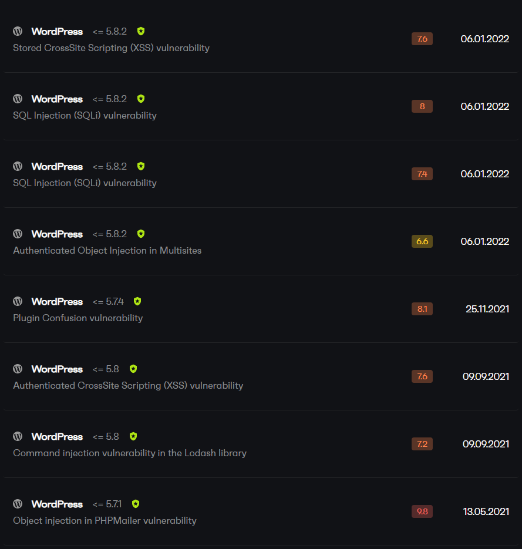
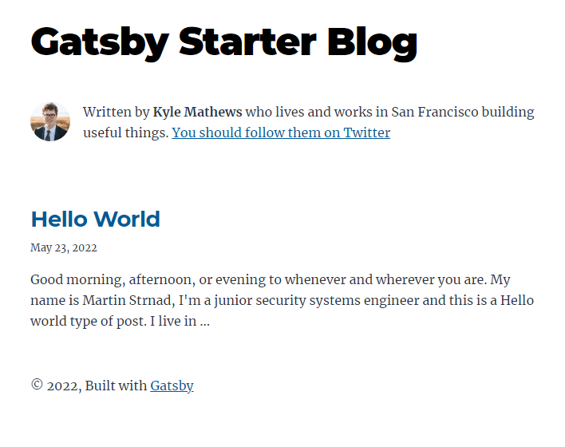
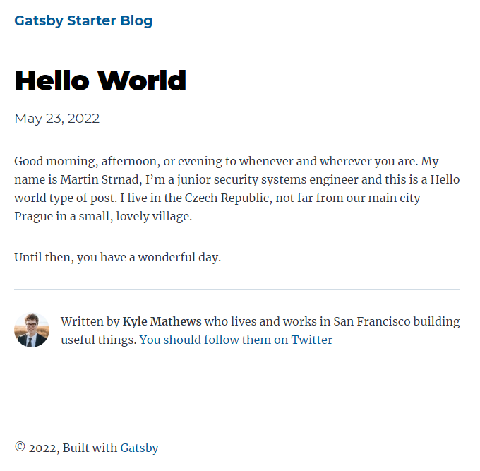
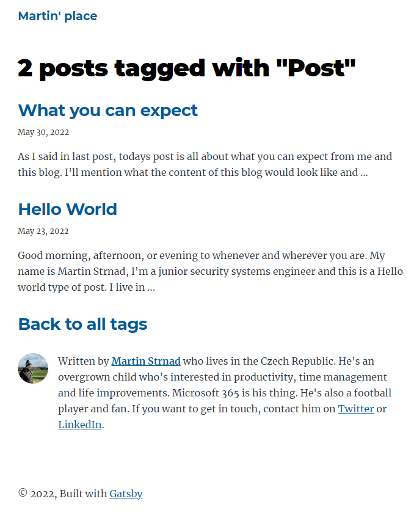
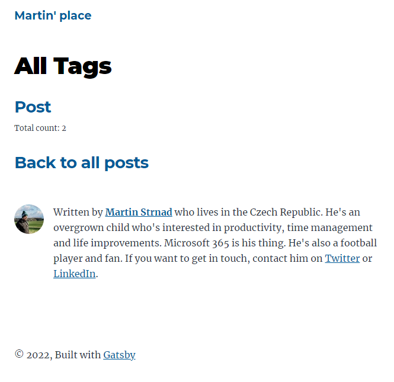
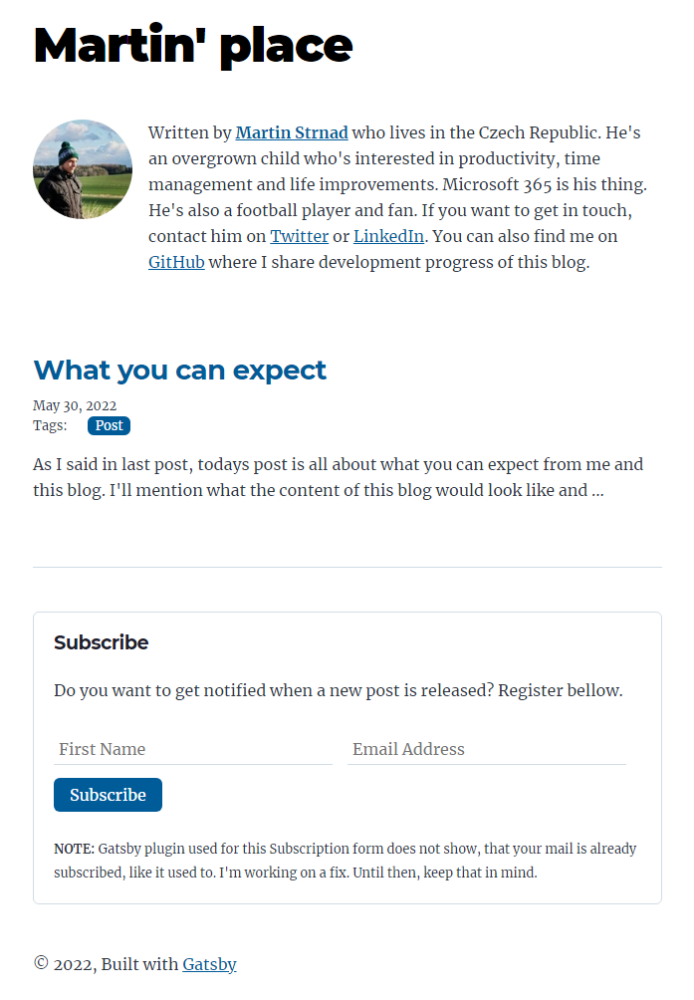
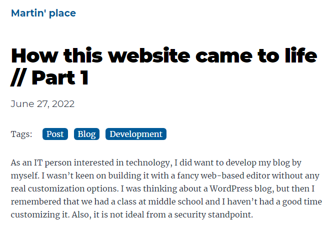

## Introduction

As an IT person interested in technology, I did want to develop my blog by myself. I wasn’t keen on building it with a fancy web-based editor without any real customization options. I was thinking about a WordPress blog, but then I remembered that we had a class at middle school and I haven't had a good time customizing it. Also, it is not ideal from a security standpoint.



I wanted something simple-looking, fast, scalable, and secure, and was looking for a platform to build my blog.

Earlier this year, I came across a book called _How to take smart notes_. It led me into a rabbit hole of finding the most suitable note-taking app for my needs. I fell in love with [Obsidian](https://www.obsidian.md) and got excited about Markdown, a simple and easy-to-use markup language. And so one of the things that the platform should've supported is to create posts in Markdown.

After searching for a while, I discovered Gatsby Framework and more importantly [Gatsby Starter blog](https://www.gatsbyjs.com/starters/gatsbyjs/gatsby-starter-blog).



It was a simple, elegant blog template, which I could customize to suit my needs and ALSO it allowed me to create content in Markdown right out of the box. I was stoked. All it needed was a bit of tweaking with the bio and profile picture and I was done. \*_Or so I thought._\* Posts had a very simple structure and so I went ahead and created my first post. Its layout is displayed here but if you want to read it, you'll find it [here](../001-hello-world)



It was super simple. Almost a bit simpler than I'd like it to be. I wanted people to be able to filter at least by categories or tags. And so I got into my first customization project for this website.

## Tags

I wanted tags on the home page to be clickable links to a page with other posts with the same tag. I also wanted a page with all tags so people can see all the categories or tags. Conveniently, the Gatsby framework had a tutorial on how to do just that. And it was fairly simple.

### Add Metadata

The first thing I had to do is to add metadata to each index.md, which represents a post so I can work with tags, query them and so forth.

```txt
---
title: How this website came to life // Part 1
date: "2022-06-27T20:01:20.284Z"
time: " min read"
tags: ["Post", "Blog", "Development"] # highlight-line
---
As an IT person interested in technology, I did ...
```

As you can see, it is a simple array of strings where each of them represents one tag. This array can be pulled from metadata (or _frontmatter_) of each index.md. 

### Query Metadata

To use field data, query it using GraphQL. All fields in frontmatter are available to query and put into some form using a custom React component.

```graphql
markdownRemark(id: { eq: $id }) {
  id
  excerpt(pruneLength: 160)
  html
  frontmatter {
    title
    date(formatString: "MMMM DD, YYYY")
    description
    tags # highlight-line
  }
}
```

### Make a page to list tagged posts

The next step is to create a tags template in a './tags' directory which will list all posts tagged with said tag. All this page does is that it takes a tag and displays the total count of posts tagged with said tag.



Since this page is around 100 rows long, I'm not going to post it here. You can always find the code on my [GitHub](https://github.com/strnad10/martins-place).

### Modify gatsby-node.js to render that page

The main method that renders all pages is _createPages_. I had to extend that method with the following code.

```js
const tags = result.data.tagsGroup.group

// Create tags pages
if (tags.length > 0) {
  tags.forEach(tag => {
    createPage({
      path: `/tags/${_.kebabCase(tag.fieldValue)}/`,
      component: tagsPage,
      context: {
        tag: tag.fieldValue,
      },
    })
  })
}
```

### Make a page that shows all tagged posts

I also wanted to create a /tags page, that will list out all tags, followed by the number of posts with that tag. To do that, I had to create a completely new page _src/pages/tags.js_.



I used a fairly similar query to the one in step two. Then I used a result from that query to display tag names as a clickable link and the total post count.

```graphql
import * as React from "react"
import PropTypes from "prop-types"
import kebabCase from "lodash/kebabCase"

import { Link, graphql } from "gatsby"

import Bio from "../components/bio"
import Layout from "../components/layout"
import Seo from "../components/seo"

const TagsPage = ({ data, location }) => {
  const siteTitle = data.site.siteMetadata?.title || `Title`
  const group = data.allMarkdownRemark.group

  return (
    <Layout location={location} title={siteTitle}>
      <Seo title="All Tags" />
      <h1>All Tags</h1>
      <ol style={{ listStyle: `none` }}>
        {group.map(tag => {
          const groupTitle = group.fieldValue

          return (
            <li key={groupTitle}>
              <article
                className="post-list-item"
                itemScope
                itemType="http://schema.org/Article"
              >
                <header>
                  <h2>
                    # highlight-start
                    <Link to={`/tags/${kebabCase(tag.fieldValue)}/`}>
                      {tag.fieldValue}
                    </Link>
                    # highlight-end
                  </h2>
                  # highlight-start
                  <small>Total count: {tag.totalCount}</small>
                  # highlight-end
                </header>
              </article>
            </li>
          )
        })}
        <li>
          <article
            className="post-list-item"
            itemScope
            itemType="http://schema.org/Article"
          >
            <header>
              <h2>
                <Link to="/">Back to all posts</Link>
              </h2>
            </header>
          </article>
        </li>
      </ol>
      <footer>
        <Bio />
      </footer>
    </Layout>
  )
}

TagsPage.propTypes = {
  data: PropTypes.shape({
    allMarkdownRemark: PropTypes.shape({
      group: PropTypes.arrayOf(
        PropTypes.shape({
          fieldValue: PropTypes.string.isRequired,
          totalCount: PropTypes.number.isRequired,
        }).isRequired
      ),
    }),
    site: PropTypes.shape({
      siteMetadata: PropTypes.shape({
        title: PropTypes.string.isRequired,
      }),
    }),
  }),
}

export default TagsPage

export const pageQuery = graphql`
  query {
    site {
      siteMetadata {
        title
      }
    }
    # highlight-start
    allMarkdownRemark(limit: 2000) {
      group(field: frontmatter___tags) {
        fieldValue
        totalCount
      }
    }
    # highlight-end
  }
`
```

### Adding tags to the main page

Lastly, I modified the main page to show tags under the date of each post, which included some query changes, some link adding and also a bit of CSS.



If you wonder, '_JEEZ! Martin, how did you create those beautiful tags?_' The answer to that is CSS magic.

```css
.tag {
  text-decoration: none;
  padding: 0 .5rem;
  margin-left: var(--spacing-3);
  color: white;
  background: #005b99;
  border-radius: 6px;
}
```

### The result

Since I initially introduced tags to my blog, a lot has changed. I polished tags a bit and added them to blog posts themselves.



I also created a subscribe form for you guys to subscribe to notifications of when I release a new post. I added code snippets to my blog as well, just to learn that it already was in some way integrated and I had to learn to render them properly.

This post is getting a bit longer than I thought. I'll have to end my development report here and leave you wondering what I did to create such an amazing subscribe form. You should BTW use it. 😁 It'll make my day. Also consider following me on [Twitter](https://twitter.com/strnad10), and [LinkedIn](https://linkedin.com/in/strnad10) and don't forget to check my progress on [GitHub](https://github.com/strnad10/martins-place/).