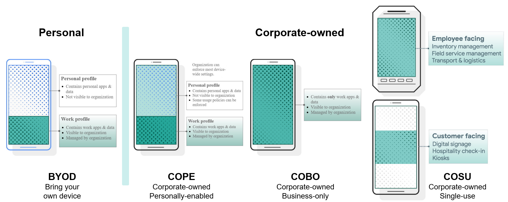
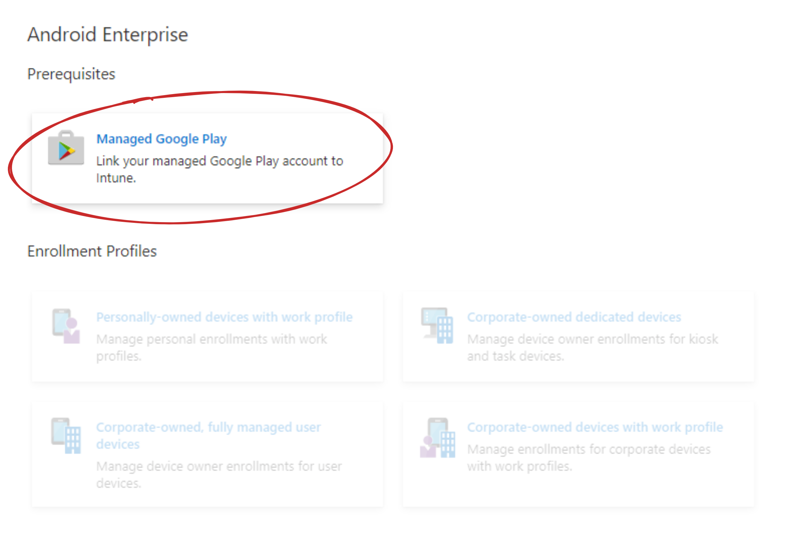
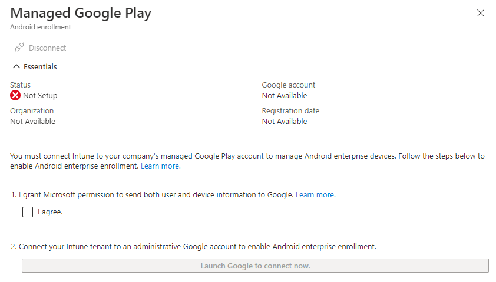
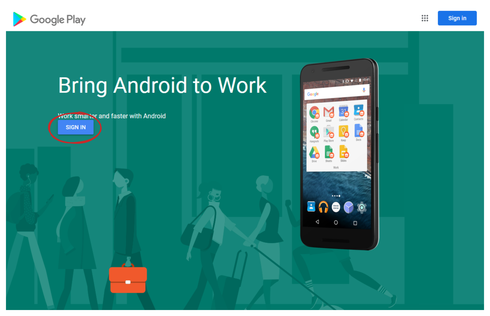
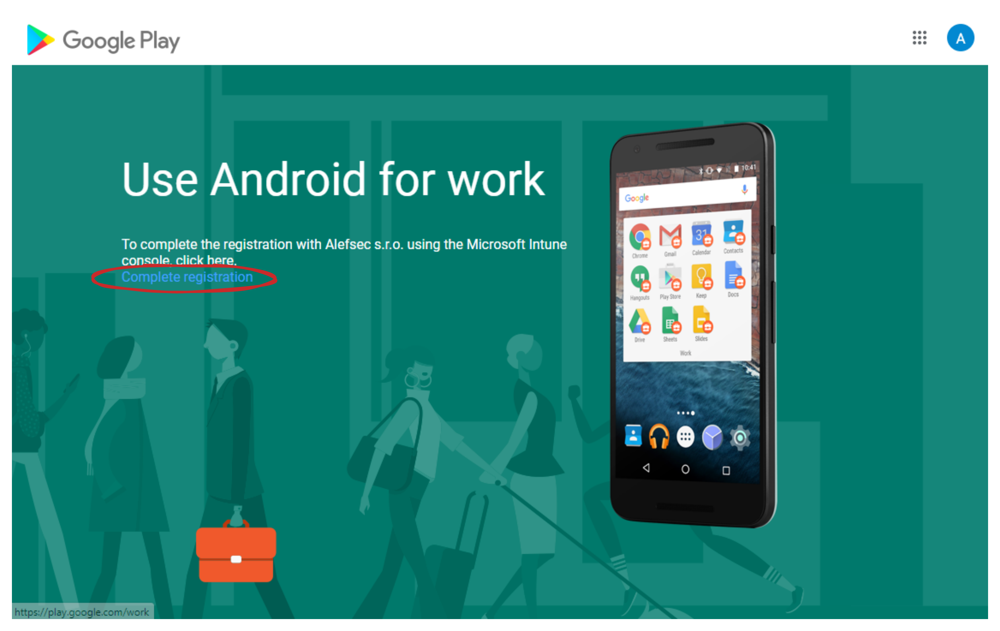
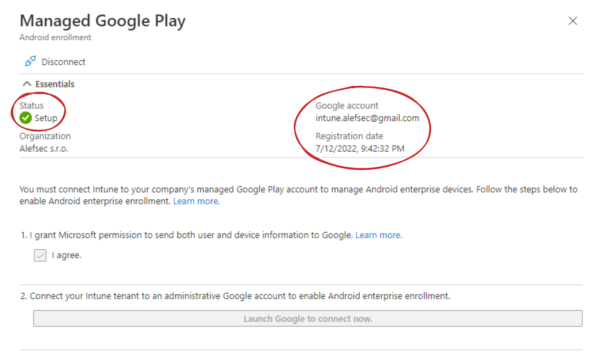
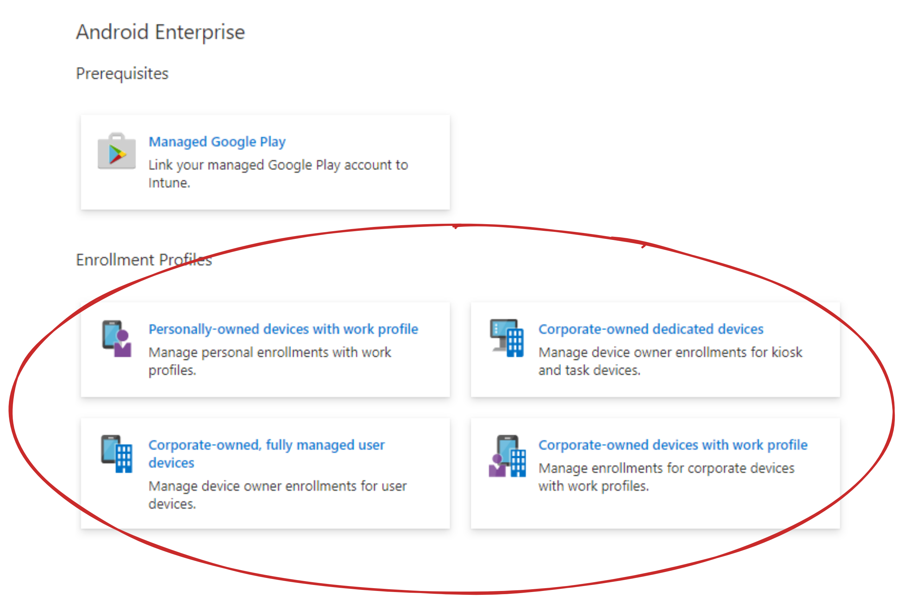

## Introduction 

I have a potential customer that wants to manage Zebra tablets which they use as scanners in their warehouses. Nowadays, they manage them using the SOTI MobiControl mobile device management solution. Since they bought a lot of licenses for their employees, they want to start managing devices using Microsoft Intune and while doing that, they would also like to migrate their scanners from SOTI MobiControl. Right now, they don’t use Intune at all.

I don’t have a license for SOTI MobiControl and I could not be bothered to install a demo and play with that. And actually, I don’t really need to since I have to factory reset all of your devices while enrolling them as Corporate-owned Single-use (Dedicated) Android devices anyway. Using Android Enterprise, you can use four management models shown in the image below. I’ll talk about every model in the future.

To manage devices using Microsoft Intune and every other MDM solution, you need to enroll devices into in. To do that in Microsoft Intune, you need to connect your Android Enterprise account to it. In the next posts, I’ll share with you an enrollment process using the COSU management model. Then I’ll show you, how to configure your devices and deploy apps and how to manage the experience using Managed Home Screen.

## History

But first, some bits and bites from history. Android originally introduced support for the management of mobile devices in Android 2.2 and it was called Android device administrator. Since then, the needs of enterprises have evolved. Android and Android Enterprise are not separate products. In 2014, with Android 5.0 (Lollipop) debuted Android Enterprise as an optional solution manufacturers could integrate in order to provide a common set of device management APIs. From 6.0 (Marshmallow) it was no longer optional and has since been a mandatory component for all GMS-certified manufacturers. To stay with the needs of enterprises, Google deprecated the Android device administrator for enterprise use in the Android 9.0 release and removed these functions in the Android 10.0. To stay current, Microsoft Intune no longer supports Android Device Administrator and Android Enterprise is the Enterprise Mobility Management API to use.

## Set up in Intune

The first thing they need to do in Microsoft Intune is to connect to an Android Enterprise account. Some of you may already have that account, but for those that don’t, I’ll show you how to configure the account and how to connect it to your Microsoft Intune.

1) Let’s go to Microsoft Endpoint Manager at endpoint.microsoft.com
2) Navigate to the Devices, then Android, and then Android Enrollment
3) In the prerequisites section, you will see is Managed Google Play.

4) When you click on that, you will see a panel open on the right side.

> Note: When your status is Setup, then you are good to go and can skip all other steps.

5) In the panel, grant Microsoft permission to send user and device information to Google. Without it, you won‘t be able to continue. Check the I agree checkbox.
6) After that, click on Launch Google to connect now button. It will open a pop-up window.
7) In the window, click on Sign in.

8) In here, you want to either sign in to an existing Google account, which is owned by your company or create a new Account.

> Note: It is important, that this should always be an account not affiliated with a specific user.

9) After a successful sign-in, you will have to click on Complete Registration.

10) You will then be redirected through a URL with a unique token and back into Intune, where the status will show a green checkmark with a Setup keyword and on the right will be your account and registration date.

And you are set and ready to use Intune for Android Enterprise management. After you close the panel on the right, the page will reload and all other options in the Android Enterprise section will be available to you.

That’s where we will pick up next. In the next post, I’ll go over how to set up an Enrollment profile and deploy a configuration profile for a device like Zebra tablet to use as a multi-application kiosk.

Until then, have a wonderful time. 😊
