## SQL Server 2012 deprecation

Support of Microsoft SQL Server 2012 and its last Service pack 4 ended on July 12, 2022, and it will no longer receive security support. You can go ahead and buy up to 3 years of Extended Security updates, which will be supported until July 8, 2025.

With that said, on August 31, 2022, all 1.x versions of Azure AD Connect will be retired because they include SQL Server 2012 components that are no longer supported. I’m a bit late to board the train, but here I am, writing about how to upgrade to version 2.x of Azure AD Connect. Your new Azure AD Connect v2 ships with a SQL Server 2019 LocalDB, which has several security-related bug fixes and promises enhanced stability and performance.

Sadly, even if you have automatic updates of the software turned on, this upgrade to a new version will not be automatic, because of the change of the LocalDB version. You have to upgrade the Azure AD Connect yourself.

Before you install the new Azure AD Connect, you have to meet some prerequisites. Your new installation of Azure AD Connect v2 must be installed on a domain-joined Windows Server 2016 or later. On the said server, you also need to install .Net Framework version 4.6.2 or newer. 

> Note: Sadly for small businesses, Azure AD Connect can't be installed on Small Business Server or Windows Server Essentials with an exception of Windows Server Essentials 2019. The server has to be standard edition or higher.

## Check the Azure AD Connect version

The first thing we should do is verify that we have an old version of Azure AD Connect.

1)	Go to your server, where the Azure AD Connect is installed.
2)	Find a Synchronization Service icon either on your desktop or in the Start menu under the Azure AD Connect folder.

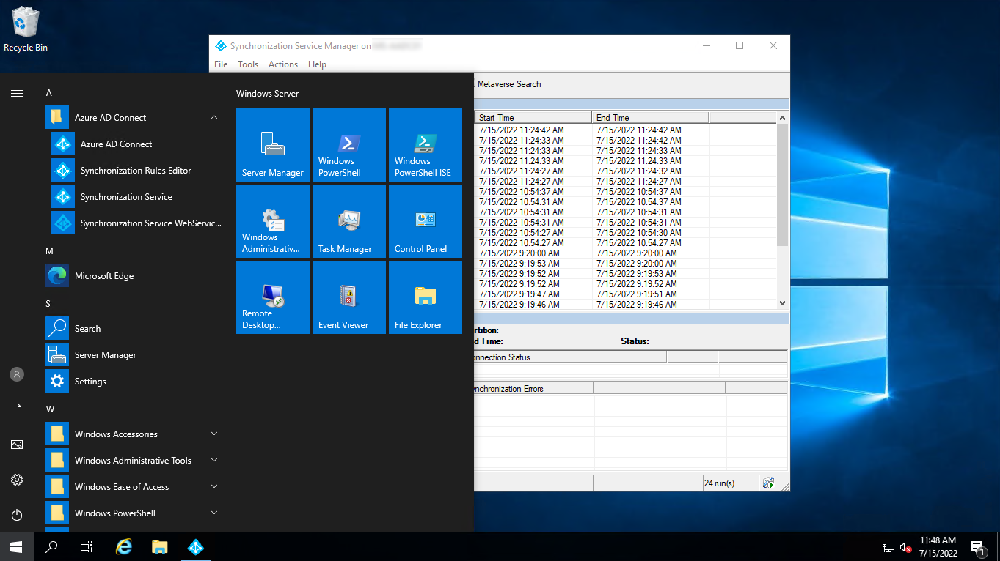

3)	Open that service and press Help > About

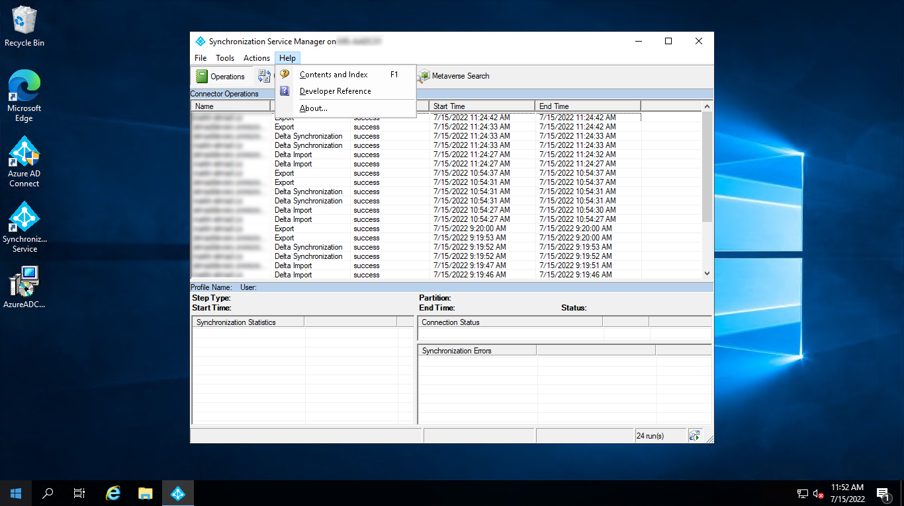

4)	In there, you should see the version of your Azure AD Connect.

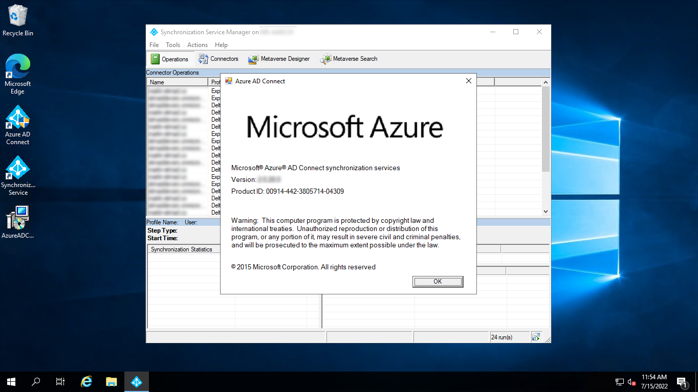

If it says 1.x, this blog post is for you. 😊

## Exporting configuration

There is a supported option for exporting a configuration of the old Azure AD Connect. You can use a PowerShell script that ships with Azure AD Connect. However, for some older versions, the PowerShell script is not shipped with it. You’ll have to install a new version of the software on a spare server and gather that script.

The PowerShell script is shipped with Azure AD Connect and you can find it in an install directory.

1)	Go to ``C:\Program Files\Microsoft Azure Active Directory Connect\Tools``
2)	In there, grab a ``MigrateSettings.ps1``

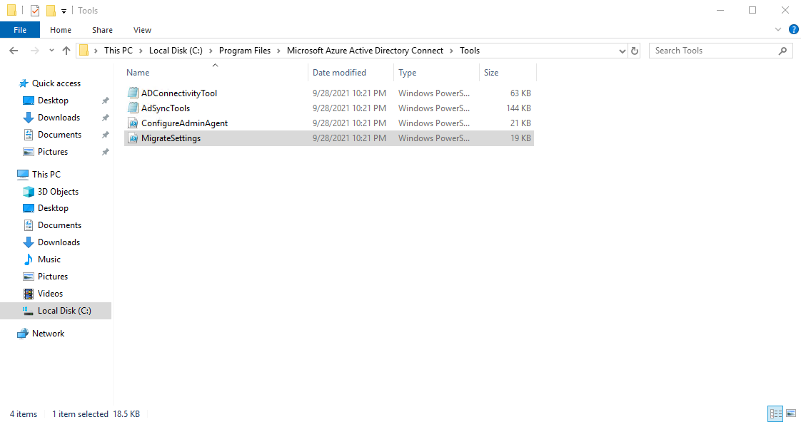

3)	Grab it and copy it to a working folder somewhere on your desktop or to the ``C:\Temp\`` folder
4)	Run a PowerShell from that working folder and call the ``.\MigrateSettings.ps1`` script
5)	It should return the following message

```Text
The downlevel server configuration was successfully exported.  Copy the entire directory to
your new staging server and select 'MigratedPolicy.json' from the UI to import these settings.

    C:\ProgramData\AADConnect\Exported-ServerConfiguration-1dfe3c83-17bf-4269-b04b-a24fb6e5af83

Please see https://go.microsoft.com/fwlink/?LinkID=2117122 for more information on completing this process.
```

6)	Go to the directory the script returned. It is always a ``C:\ProgramData\AADConnect\Exported-ServerConfiguration-HASH`` directory.
7)	Grab the whole directory and put it somewhere accessible from the new Azure AD Connect server.

## Analyze the exported settings

In a case where you know that you customized the installation of your Azure AD Connect, I highly recommend you to check the exported settings using a tool called Azure AD Connect Configuration Documenter. It is a program that is located on Microsoft’s GitHub and you can find it [here]( https://aka.ms/aadconnectconfigdocumenter). This is useful in the case of custom synchronization rules, seeing all settings in one place, and more. Go to the releases page and download a zip, which has the following structure.

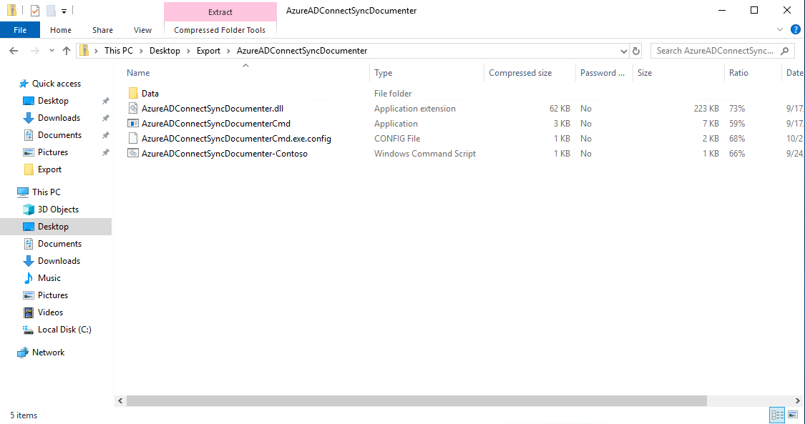

1)	Ideally, copy that to the working directory on the old Azure AD Connect server
2)	Unzip the .zip file
3)	Place a folder with the exported configuration in the *Data* folder
4)	Go to the root folder of the Documenter program and run a PowerShell

> Note: Hold shift and right-click a blank space. It will bring up a context menu from which you can run PowerShell in that directory.

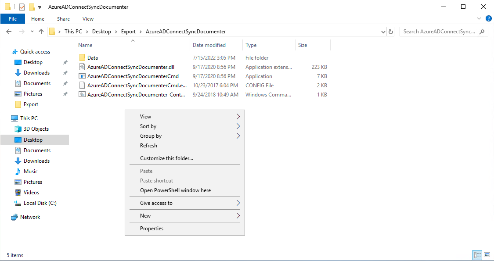

5)	Run the following command

```PowerShell
.\AzureADConnectSyncDocumenterCmd.exe "Export" "Export"
```

6)	Running this command will create a folder Report, in which you’ll find an HTML report. By opening that, you will see a detailed report of your configuration.

We will use this tool to compare the old configuration with a new one. Since we have the configuration exported, we can use it in the installation step to drastically simplify the whole process.

## Install new Azure AD Connect

Let’s get going with the upgrade process. Let’s assume that you have already created a VM or configured a machine and installed Windows Server 2016 or 2019 on in to simplify it a bit. Let’s also assume that .Net Framework is installed. Let’s download a .msi package and run the install.

1)	Download a new installation media for Azure AD Connect v2. A quick google search for ‚Azure AD Connect v2 download‘ will do
2)	On the microsoft.com download page, you will see a button to download the .msi package. Before you click that, check that it is the right version under details

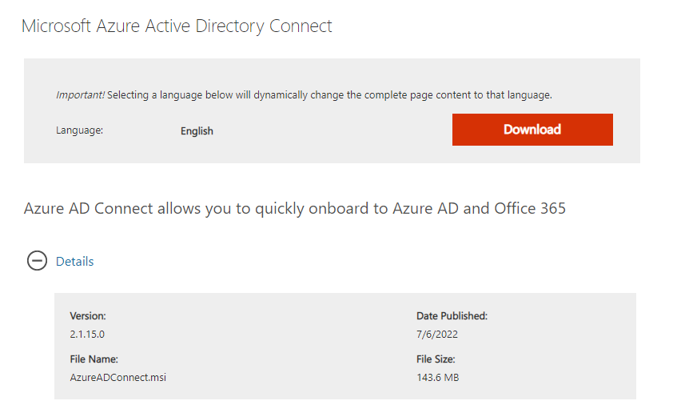

3)	If it says 2.x.xx.x, you can click the Download button
4)	After a while, an AzureADConnect.msi file will download
5)	Go to the newly prepared server and take the downloaded file with you
6)	Run the file as an administrator
7)	It will open a Welcome to Azure AD Connect window. In there, you have to agree with license terms and privacy notice. Then click Continue

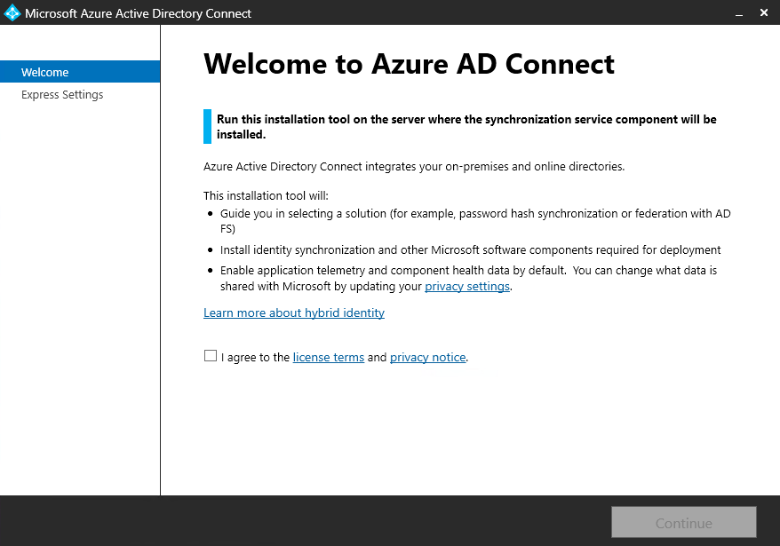

8)	On the next page, click Customize.

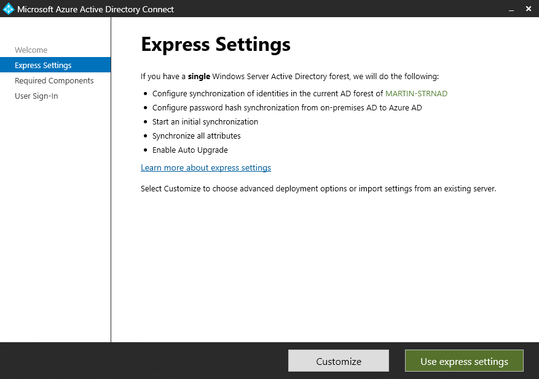

9)	From here, you can do a lot of things, but more importantly, you can Import synchronization settings. Check that checkbox. Settings Location textbox will appear and next to it will be a Browse button. Click it
10)	In step 7 of the Export configuration process, we placed a folder with our configuration in a location that the new server can access. Navigate to that location and select the MigratedPolicy.json. After that, click Install.

> Note: Importing a configuration will not completely set up the new Azure AD Connect. Instead, the import installation experience will prefill all the settings for you. It is intentionally kept simple with minimal inputs from the user to easily reproduce and set up new sync servers.

11)	On the next page – as noted above – our authentication mechanism will be preselected. Verify those settings and click Next.

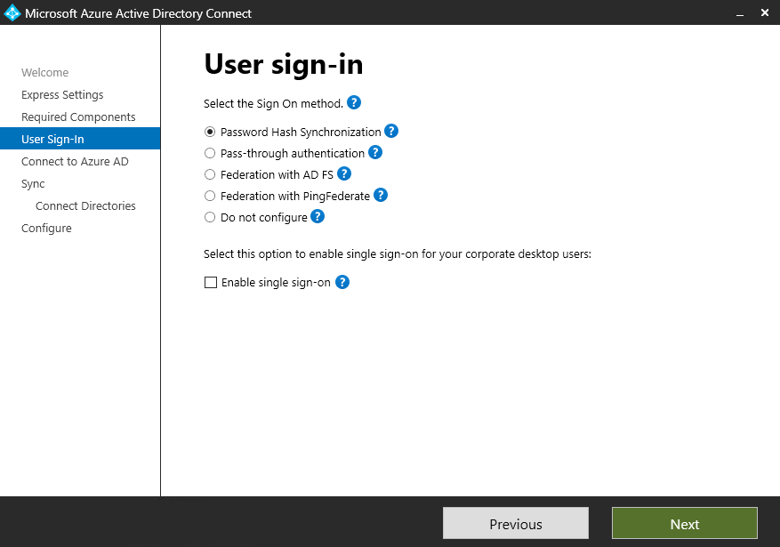 

12)	Next comes the Connect to Azure AD page, where you have to sign in to Microsoft 365 using a global administrator account. Conveniently, a username that you have used in the initial setup will be prefilled. Log into Microsoft 365 and proceed.

> Note: Either use a global administrator account without MFA (which I would not recommend having in your tenant in the first place) or place this [URL](https://secure.aadcdn.microsoftonline-p.com/) to the trusted sites list.

13)	Once on Connect your directories page, change credentials to your domain. Once finished, you should see a green checkmark. After that, click Next. Again, as a result of the import, you should see your domain here

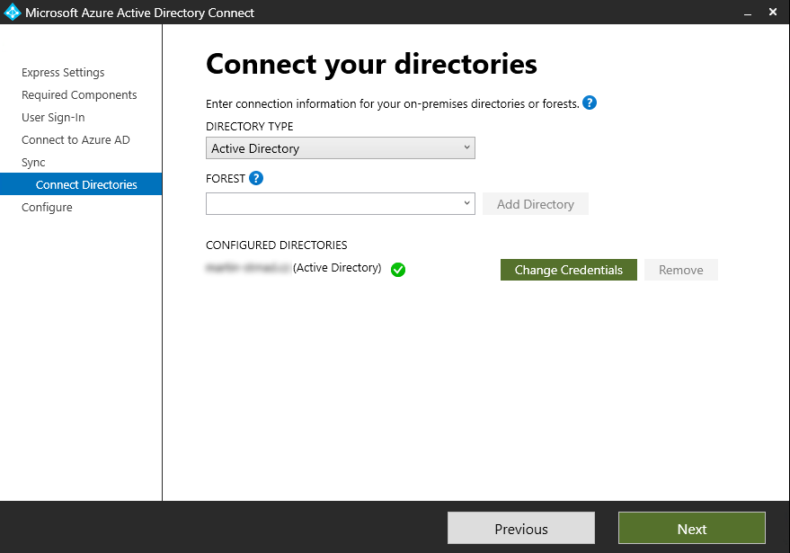

14)	As the last step, I would recommend having to Enable staging mode and Start the synchronization process checked. Then click Install

We leave staging mode enabled for now so that the server does not export any changes in your Active Directory to Azure Active Directory and vice versa. We also want to run the synchronization (which will not make any changes to any directory) so we can verify, that it all ran without any errors.

## Check if the synchronization was successful

Once the installation finishes, you should open the Synchronization service to check that your synchronization is running without any errors. Initial synchronization was automatically started after the installation finished and so you should see 6 new records in the synchronization service.  Two of which are Full import, the other two are Full synchronization and the last two are Export.

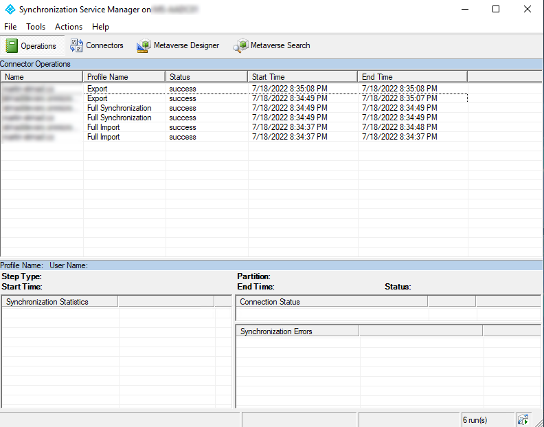

## Compare the two configrations

As I said earlier, you can use documenter to compare the two configurations and see if you have two identical configurations. It is just to showcase some of the functionalities of this tool. Use it as you wish.

1) Export configuration as in the *Exporting configuration* section of the blog, except on the new sync server.
2) Place it into the Data folder as in the *Analyze the exported settings* section
3) Then go ahead and run a Powershell and navigate to the folder with *.\AzureADConnectSyncDocumenterCmd.exe* file
4) In this location, run the following PowerShell script.

```PowerShell
.\AzureADConnectSyncDocumenterCmd.exe "oldConfig" "newConfig"
```

It will create an export file in the *Reports* folder called ``oldConfig_AppliedTo_newConfig_AADConnectSync_report.html``. In the report, you can see a comparison of both configurations. I’m not going to show you the results since I may show something inappropriate. And it will hopefully encourage you to go ahead and try it yourself.

With that said, I hope this was somewhat helpful to you. If you want to know more about me, head to the *About* section of this blog or contact me via some of my social media.

One last thing before I let you go. Please, go to your own social media and share this post with your friends so more people get to know about what I do. I’d really appreciate that. Have a wonderful day wherever you go and whatever you do. 😊

> Note: For you security folks out there, from a tiering model standpoint, the Azure AD Connect server must be treated as a Tier 0 component. Hardening your Azure AD Connect server is also recommended to decrease the security attack surface of this critical component of your IT infrastructure. Since I’m interested in security in Microsoft 365 services, I’ll probably cover this topic at some point in the future.
