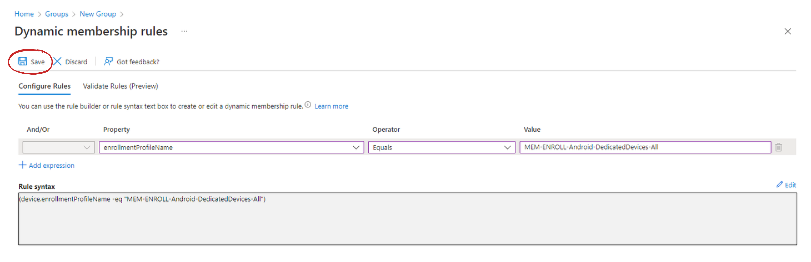

In the last Intune post, I showed you, how to [connect your Android Enterprise account to Microsoft Intune](https://martin-strnad.cz/005-start-with-android-enterprise/) so you can start managing your devices. If you missed that post, or your options to enroll Android devices are greyed out as those on the image below, go ahead and read it.

In the mentioned post, I also talked about a customer of mine, where we are deploying the COSU management model. This model is about managing all of your devices' functionality and restricting users to a small number of apps or even only one app.

To get management capabilities over your devices, you need to enroll them into Microsoft Intune. Enrolling your devices into Microsoft Intune is done by creating an enrollment profile and scanning the QR code or inserting a code manually. Bare in mind that enrollment into the COSU model is only possible from a welcome screen when initializing the device.

## Enrollment profile

For Android devices alone, there are 7 options to enroll them into Microsoft Intune.

1) What you want to do is to go to **Devices** > **Enroll devices** > **Android enrollment** and in there, you should see options for Android Enterprise enrollment.
2) Select **Corporate-owned dedicated devices.**

> Note: As stated in the description of this option, this is ideal for kiosk devices that will run one or multiple applications.

3) You should see an option to create a profile. Click **Create profile** and continue.

4) Fill out the name of the policy. I recommend using some sort of naming convention. Also, fill out a fitting description.

For my policies in Microsoft Intune, I use ``MEM-ENROLL-Android-DedicatedDevices-All``. At first sight, you can tell that this policy is from *Microsoft Endpoint Manager* and it is an *enrollment profile policy* for *Android* devices. You can also see that it should be used for *all dedicated devices*.

5) Select a **Token type**. For purposes of this video, I'm choosing **Corporate-owned dedicated devices (default)**.
6) Choose a **Token expiration date**. You can choose up to 3 months, which is also a default duration. Your profile should look something like this.

7) Click **Next**, review your configuration and click create.

This will create an Enrollment profile that has a string and QR code in it. You can either scan the QR code or insert the code manually. The only option for you to enroll dedicated devices is to factory reset the device and enroll it through the initial welcome process.

## Create a group

All configurations must be assigned to a group of users or devices. These are user-independent devices, so we can't target users in the scope of this group. We have to target devices and the easiest way to do that is to create a dynamic group that targets devices that use the enrollment profile we just created.

1) In Endpoint manager, go to **Groups**
2) At the top, click **New group**
3) Leave the Group type as **Security**
4) Add a fitting group name ideally using a naming convention. In my case, I'll use *AAD-DEVICE-DedicatedAndroidDevices*. Also, add a description
5) Switch a membership type to **Dynamic Device**
6) Under dynamic device members, click **Add dynamic query**

Ideally, you want to target only devices, that are enrolled using the profile you just created.

7) As property, select **enrollmentProfileName**
8) Pick **Equals** as an operator
9) Value should be filled with the name of the enrollment profile. If you didn't copy the name of the profile, be careful with capitalization. The field is case-sensitive. In my case, I used *AAD-DEVICE-DedicatedAndroidDevices*

The query should look something like this:

10) Then click **Save**. In the next window, click **Create**

By now, you should have a dynamic group, that targets only specific devices. If you already enrolled a test device using the enrollment profile, you should see it in members of the group. We can check back after we enroll our testing device.

## Approve and assign applications

In the case of my customer, their devices - Zebra tablets - will be used as scanners. To allow users to use only specified applications, we want to run only the scanner app and Managed Home Screen. These types of devices can be picked up and carried for a few hours and then left where you picked them up.

Fortunately, one of these applications is already added. After connecting to Google Play, Intune automatically adds these four common Android Enterprise-related apps to the Intune admin console:
- **Microsoft Intune** - An application is used for Android Enterprise fully managed, dedicated, and corporate-owned devices with work profile scenarios.
- **Microsoft Authenticator** - This application helps you sign in to your accounts if you use two-factor verification, and is also used for Android Enterprise dedicated devices that are enrolled using Azure AD Shared device mode.
- **Intune Company Portal** - An application used for Android Enterprise personally-owned work profile scenarios, as well as App Protection Policies (APP).
- **Managed Home Screen** - An application used for multi-app kiosk mode on Android Enterprise dedicated devices.

### Assigning Managed Home screen

We don't need to do anything with those apps, so we can go ahead and assign the Managed Home Screen to our devices right away.

1) Go to **Apps** > **Android**

You should see a similar list as shown below:

2) Click the **Managed Home Screen** app.
3) Click **Properties**. You should see properties and at the bottom, there is an **Assignments** section. Click **Edit** right next to the Assignments keyword
4) In the Edit application section, there are 4 options to which you can assign user or device groups.

Applications can be pushed to devices directly and can be displayed as available in Managed Google Play Store for only enrolled devices or even for devices without enrollment using Mobile Application Management functionalities. The last option is there to force uninstallation of the application from the said scope of users of devices. In this case, we want to install the app right away.

5) Click **Add group** under the Required option
6) Select the group we just created and click **Select**
7) Next, click **Review + save** and then **Save**

When we enroll our testing device, the application will be installed automatically. The Managed Home Screen application is a prerequisite to running the device in Multi-app kiosk mode.

### Approving new application

Surely, it is not the only application you want to run. Let's add another application, this time from a Managed Google Play store. I don't have an exact application to show, so I'll be adding Microsoft Edge.

1) Again, in Android apps, click **Add** at the top of the window
2) As an app type, select a **Managed Google Play app**. You should see the selection below. Then click **Select**

3) You should see a Managed Google Play store with some recommended applications. Look for **Microsoft Edge web browser** using the search.

5) Click **Approve** and the **Approve** again to give the application the necessary permissions. You can then select what to do when the permission requirements of the application change.
6) Once you approve the application, go back to the Android app list and click **Sync**. After a quick sync, the app will appear in the list of apps ready to be assigned
7) Click the **Microsoft Edge: Web Browser** of type Managed Google Play store app
8) In **Properties**, edit the assignment to what option suits your needs. I went with **Required** again

### Enabling system application

In some cases, you may need to enable a system application. To show you just that, I'll add a Samsung camera app to Intune. All of my tests are run on Samsung Galaxy Note 10 Lite, which I have at hand. To enable such an application, you need to know its package name. For many applications, it is not hard to get from a Google search, however, to get the Samsung camera package name, I had to install a 3rd party application to show me the name.

1) Go to **Android apps** again
2) **Add** a new app and this time, select **Android Enterprise system app** as the app type. Then click **Select**

3) Give your application a **name** like Samsung Camera
4) Specify a **publisher** name
5) Fill in the **package name**. In the case of the Samsung camera, the package name is *com.sec.android.app.camera*
6) Click **Next**
7) Assign the application to the group we created earlier. Since it is a system application, it can not be installed. That's why there is only the Required option
8) Then click **Next**

9) Lastly, click **Create**

The last thing to do then is to enroll the device and we're good to pilot the deployment, right? Wrong! We need to create a configuration profile to run the device in Kiosk mode and apply a basic configuration.

However, this post is getting quite long. For the configuration and enrollment itself, you will have to wait till next time. Before you go, consider sharing this post with your friends so more people get to see about what I do. I’d really appreciate that.

Have a wonderful day. 😊