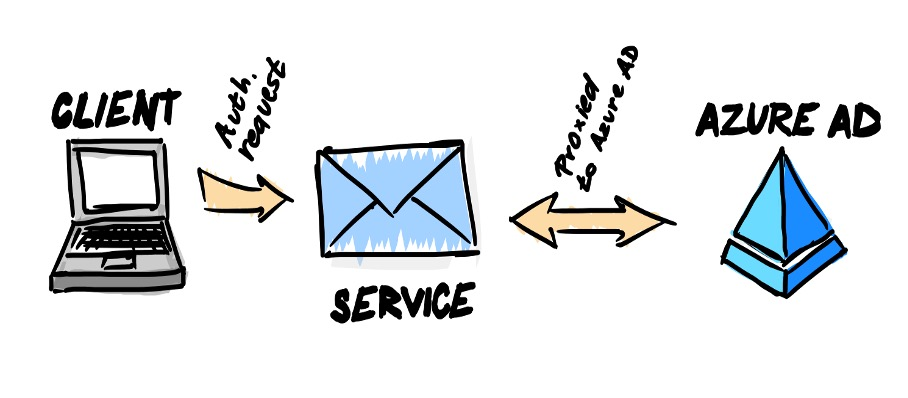
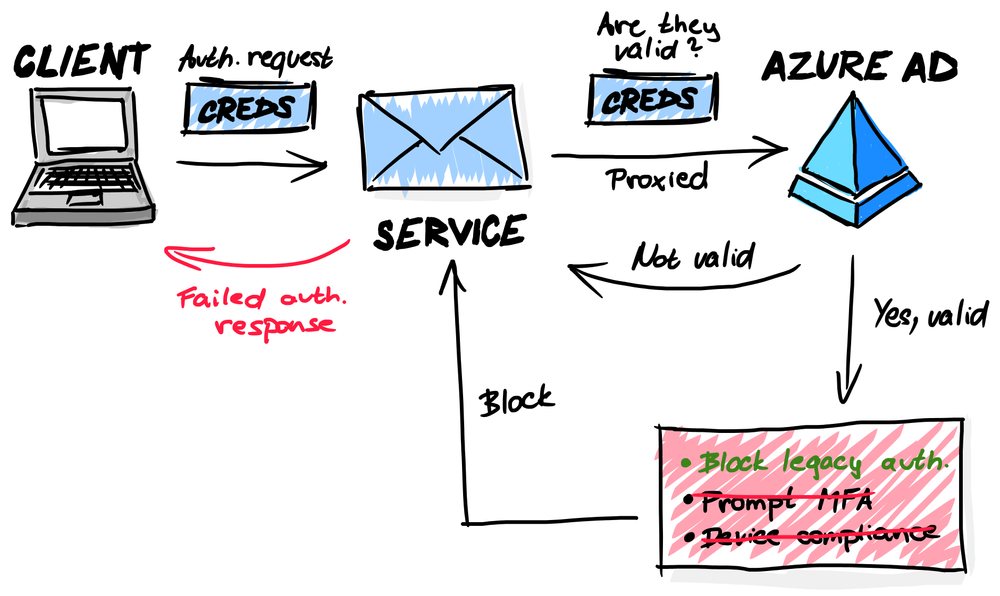

Howdy folks. I didn't have much time recently. Mainly because I was preparing my wedding. It was a wonderful day and we really enjoyed it. Since our wedding is over, I now have time to continue posting more blog posts. YAY! 😁

I had a presentation last week about identity and one of my topics was conditional access. I was describing basic vs. modern authentication and how conditional access is evaluated during modern authentication. I also mentioned that no conditional access is evaluated during legacy authentication.

Last thing I mentioned was that the most recommended conditional access policy other than enabling MFA for all is "Blocking
legacy protocols". And then, one of attendees asked:

> Well, how does the policy blocks legacy authentication, when a legacy protocol is used and no conditional access is evaluated during legacy authentication?

At that time, I did not know, how to answer that question. And I don't like the fact that I don't know the answer. Later that day, I figured, how it works and I thought that I should share it with you. To understand, how it works, you have to know, how does legacy and modern authentication works. Let's get right into it.

## Legacy authentication

We refer to older protocols like POP3, IMAP, SMTP and so on as legacy authentication. To put it simply, a legacy authentication is a client or network protocol which is incapable or not configured to do modern authentication. That means that the request can't be "interrupted" for MFA or any other conditional access control. **They demand a yes answer or they fail.**

For example, here is a Extended SMTP communication:
```
S: 220 mail.example.com ESMTP Postfix
C: EHLO example.net
S: 250-mail.example.com
S: 250-EXPN
S: 250-HELP
S: 250 SIZE 1000000
C: MAIL FROM:<sender@example.net> SIZE=500000
S: 250 Address Ok.
C: RCPT TO:<friend@example.com>
S: 250 friend@example.com OK; can accomodate 500000 byte message
C: DATA
S: 354 Send message, ending in CRLF.CRLF.
…
C: .
S: 250 Ok
C: QUIT
S: 221 Goodbye
```

There is no room for additional details that Conditional access can use to evaluate conditions and apply controls. Simply, this is how the flow of legacy authentication works.



## How does blocking work?
Conditional Access policies are always applied after successful authentication, regardless of the protocol.

Legacy protocols talk directly to corresponding service and the request is then proxied to Azure AD on behalf of the user. The client sends the authentication request to the service, with the credentials. The service validates the credentials with Azure Active Directory. After the service validates with Azure AD that the credentials are OK, then the only Conditional access policy that is compatible with the proxied request is to block the legacy authentication requests. If the policy is configured to block legacy protocols, the service receives a denied response from Azure AD and the user's login is not successful.



I hope that you find this article somewhat useful. If you do, share it with your friends. If you want to talk to me, you can message me on [Twitter](https://twitter.com/strnad10) or [LinkedIn](https://www.linkedin.com/in/strnad10/). Thank you for reading and have a nice rest of your day. 😉

PS: For those of you that are looking forward to see part 2 of Android dedicated device enrollment, I'll release it this month. Part 1 can be found [here](https://martin-strnad.cz/007-android-dedicated-devices/).