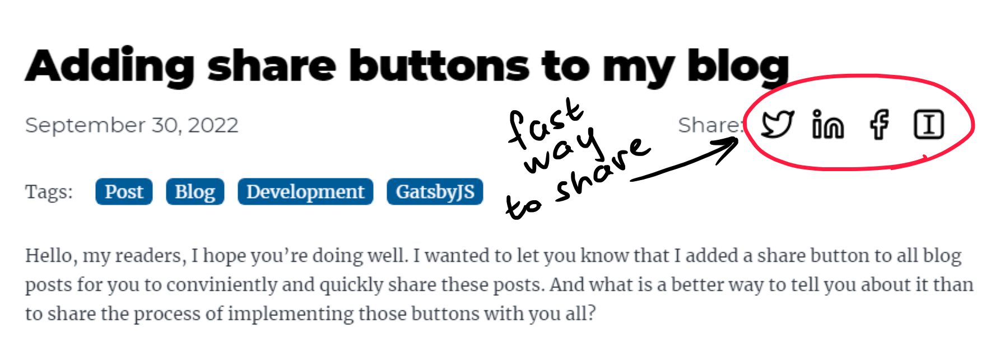

## New addition to my website

Hello, my readers, I hope you're doing well. I wanted to let you know that I added a share button to all blog posts for you to conviniently and quickly share these posts. And what is a  better way to tell you about it than to share the process of implementing those buttons with you all?

## Prerequisites
### Packages
I'm using a package called [react-share](https://www.npmjs.com/package/react-share) which is a package that lets me add social media share buttons and display share counts in my posts. 

I assume that you already have a Gatsby blog up and running and you ran a saw a Gatsby code at least once in your life. If not - check out [Gatsby Starter blog](https://www.gatsbyjs.com/starters/gatsbyjs/gatsby-starter-blog/). You will need to install the react-share package.

Start a PowerShell, Command Line, Bash or what ever terminal you are using and run this command:

``` PowerShell
npm install react-share
```

### Blog post template
The template you use may vary depending on customizations you already made to your GatsbyJS blog. To make it easier for you all to follow, I'll demonstrate the implementation process on the Gatsby starter blog [post template](https://github.com/gatsbyjs/gatsby-starter-blog/blob/master/src/templates/blog-post.js). I left out some pieces of code to have a smaller footprint.

This is a **blog-post.js** file right before I started the implementation of share buttons.

```jsx
// ...

const BlogPostTemplate = ({
  data: { previous, next, site, markdownRemark: post },
  location,
}) => {
  const siteTitle = site.siteMetadata?.title || `Title`

  return (
    <Layout location={location} title={siteTitle}>
      <article
        className="blog-post"
        itemScope
        itemType="http://schema.org/Article"
      >
        <header>
          <h1 itemProp="headline">{post.frontmatter.title}</h1>
          <p>{post.frontmatter.date}</p>
        </header>
        <section
          dangerouslySetInnerHTML={{ __html: post.html }}
          itemProp="articleBody"
        />
        <hr />
        <footer>
          <Bio />
        </footer>
      </article>
      <nav className="blog-post-nav">
        ...
      </nav>
    </Layout>
  )
}

// ...
```

## Implementation

### ShareButtons component

The first thing to do is to create a **ShareButtons.js** component, which will be used in the blog template itself. We can also hard-code it into the post template but we want to keep the code reusable. I might increase the number of buttons in the future but for now, I went with Twitter, LinkedIn, Facebook, and my favorite read-later app which has been for years [Instapaper](https://www.instapaper.com). React-share offers 21 in total and can show a share count in 7 of those applications. It is more than enough for my needs.

The React-share package also comes with a pack of icons if you want to use them. I went with icons I already use in the navigation component. The first section of code imports a few necessary packages from react, react-share, and gatsby-plugin-image.

After the import section, the ShareButtons component starts. I feed the URL, title, and description into it. The TwitterShareButton component and the other three are premade components imported from the **react-share** package. Inside, I use the StaticImage component from **gatsby-plugin-image** to display icons. Then repeat for other buttons.

```jsx
import * as React from "react"
import {
	TwitterShareButton,
	LinkedinShareButton,
	FacebookShareButton,
	InstapaperShareButton,
} from 'react-share';
import { StaticImage } from "gatsby-plugin-image"

const ShareButtons = ({ url, title, description }) => (
	<div className="postShare">
		<p class="postShareLabel">Share: </p>
    
    <div class="postShareButtons">
      <TwitterShareButton url={url} title={description}>
        <StaticImage
          className="postShareIcon"
          layout="fixed"
          formats={["auto", "webp", "avif"]}
          src="../images/shareButtons/Twitter.svg"
          width={30}
          height={30}
          quality={100}
          alt="Twitter"
        />
      </TwitterShareButton>

      <LinkedinShareButton url={url} title={title} summary={description}>
        ...
      </LinkedinShareButton>

      <FacebookShareButton url={url} quote={description}>
        ...
      </FacebookShareButton>
      
      <InstapaperShareButton url={url} title={description}>
        ...
      </InstapaperShareButton>
    </div>
	</div>
);

export default ShareButtons
```

### Adding component to blog-post.js

Once you create the component, you can add it to your **blog-post.js** template. I added it into the header right after a date.

```jsx
// ...

const BlogPostTemplate = ({
  data: { previous, next, site, markdownRemark: post },
  location,
}) => {
  const siteTitle = site.siteMetadata?.title || `Title`
  // highlight-start
  const url = typeof window !== "undefined" ? window.location.href : "";
  // highlight-end
  return (
    <Layout location={location} title={siteTitle}>
      <article
        className="blog-post"
        itemScope
        itemType="http://schema.org/Article"
      >
        <header>
          <h1 itemProp="headline">{post.frontmatter.title}</h1>
          <div class="postMetaData">
            <p class="postDate">{post.frontmatter.date}</p>
            # highlight-start
            <ShareButtons 
              url={url}
              title={siteTitle}
              description={post.frontmatter.description || post.excerpt}
            />
            # highlight-end
          </div>
        </header>
        <section
          dangerouslySetInnerHTML={{ __html: post.html }}
          itemProp="articleBody"
        />
        <hr />
        <footer>
          <Bio />
        </footer>
      </article>
      <nav className="blog-post-nav">
        ...
      </nav>
    </Layout>
  )
}

// ...
```

### Styling the buttons

I want the blog to be as minimalist-looking as possible. To keep it that way, I added a few lines of code to the **style.css** file to make those buttons look cool.

``` css

/* Post date and Share buttons */
.postMetaData {
  display: flex;
}

.postDate {
  flex: 1;
}

.postShareLabel {
  flex: 1;
  text-align: right;
}

.postShare {
  flex: 1;
  display: flex;
}

.postShareButtons {
  flex: 1;
}

.postShare button {
  float: left;
  margin-left: 15px;
}

.postShare button:hover {
  filter: invert(16%) sepia(93%) saturate(3150%) hue-rotate(186deg) brightness(95%) contrast(122%);
}

```

### Result 😲

The result should look something like this. 



I'm very pleased with how they turned out. And they work perfectly. If you find this post helpful, try using them and share any of my posts with your friends, family, or colleagues.

Until next time, have a nice day and enjoy your life. 😊