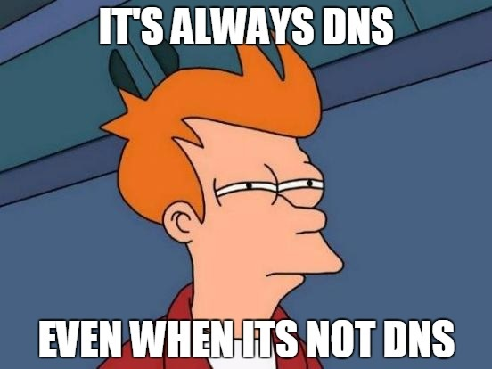
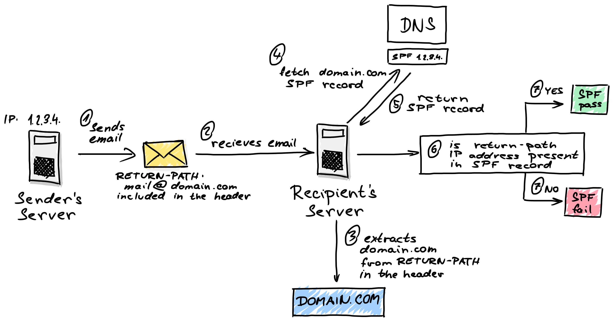
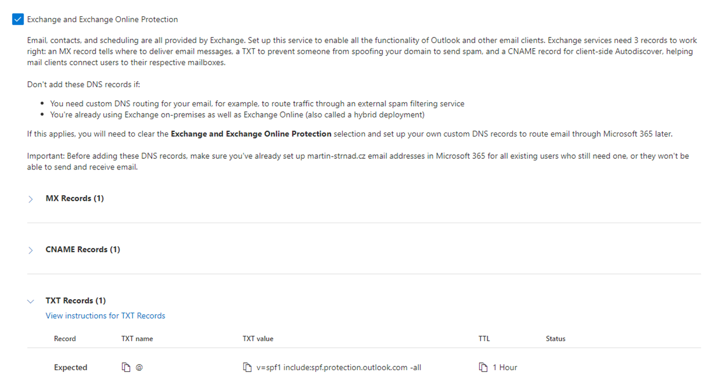
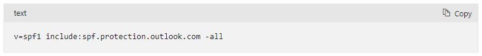
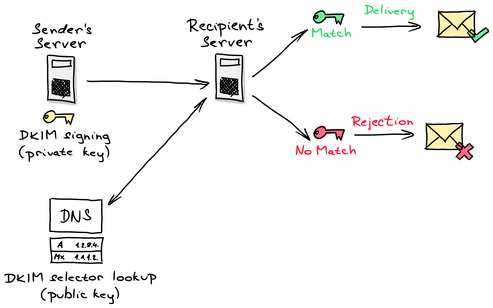
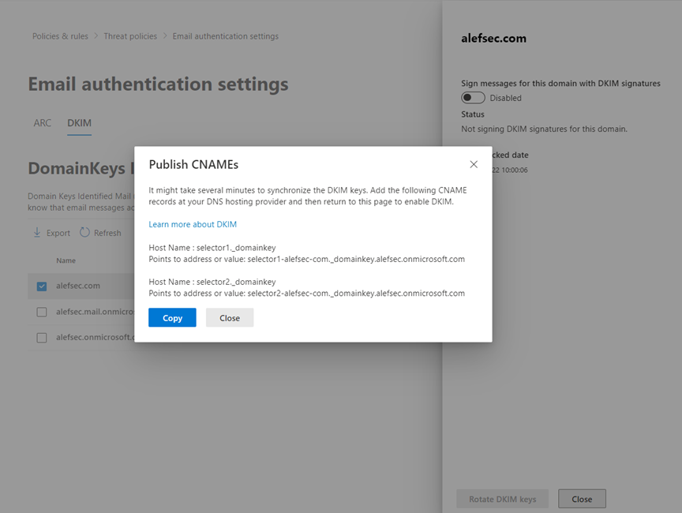
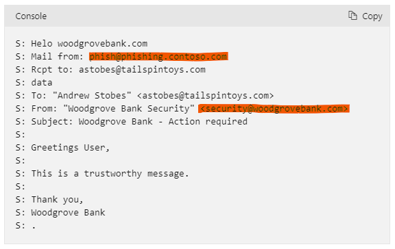
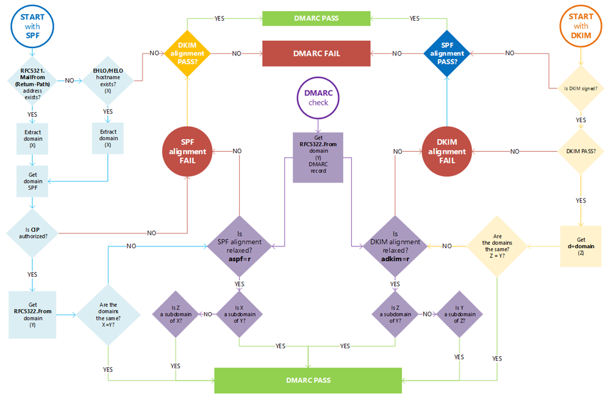
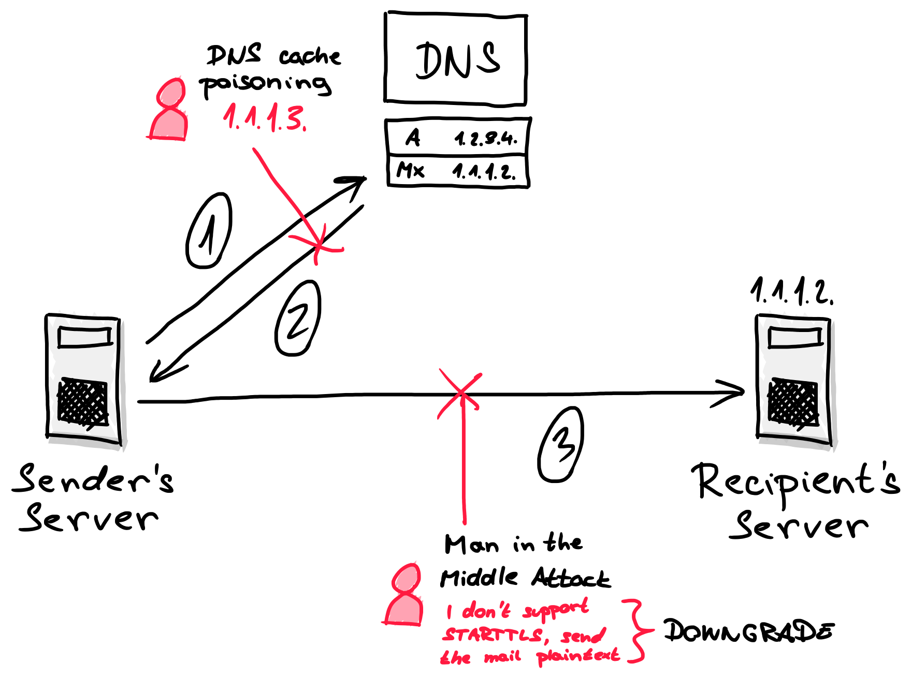
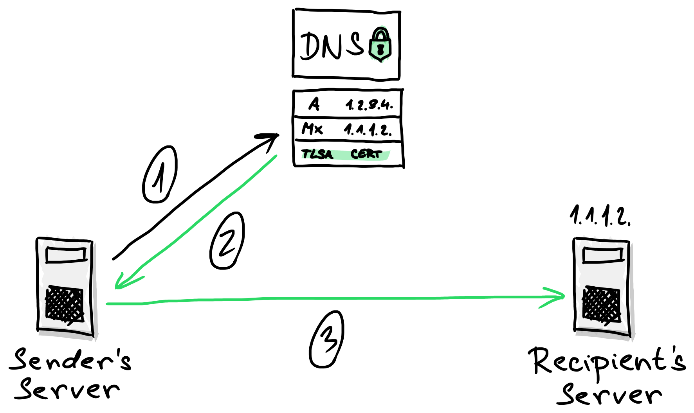

## Secure your email communication

We use email communication on a daily basis. Since we use it daily to communicate with our customers, employees, and colleagues, we would think that the communication is secure and we can send anything we want. Sadly, it is not the case most of the time. You might ask why is that. Well, to transfer an email communication from a sender's email server to a recipient's email server, the email is sent via SMTP (legacy) protocol. When the email is sent to the recipient's server, it is not encrypted and the mail itself does not contain any mechanism to verify the authenticity or integrity of the message. It does not even have any mechanism to verify the identity of the sender.

That being said, there are a lot of things a bad actor should do to the message and negatively affect your or the recipient's organization. Here are some of them:

> **Phishing**
>   'Fraudulent practice of sending emails purporting to be from reputable companies in order to induce individuals to reveal personal information, such as passwords and credit card numbers.'
> 
> **Spoofing**
> 'Act of disguising a communication from an unknown source as being from a known, trusted source.'
>
> **Business email compromise attacks**
> 'A type of cyber crime that uses email fraud to attack commercial, government and non-profit organizations to achieve a specific outcome which negatively impacts the target organization.'
>
> **DNS cache poisoning**
> 'Act of entering false information into a DNS cache, so that DNS queries return an incorrect response and users are directed to the wrong websites (in our case, email is sent to wrong email server).'
>
> **Man in the Middle TLS Protocol Downgrade attack**
> 'A type of cyber attack in which the attacker secretly intercepts and relays messages between two parties who believe they are communicating directly with each other. By intercepting and altering the communication, the attacker is able to force the communication to be sent as a plain text and not use the STARTTLS protocol for email encryption.'

To help address said issues and help organizations protect their email communication and users from said attacks, a few protocols were introduced. They are powerful tools to protect your users and organization, but the adoption of those protocols at least in the Czech Republic is not as high as one might think. I want to address that in this article. I also want to talk about each of the protocols and how to set them up to run with your Microsoft 365 environment. This should be useful for organizations in the Czech Republic that have to comply with the *Act No. 181/2014 Coll. of July 23, 2014, on Cyber Security* and many others.

So what are these protocols, what do they do and what are they used for? Let's get right to it.

An ancient (by IT standards) administrator lesson says that any problem connected with information technology can ultimately be traced to an error at the level of the DNS protocol. To function, all of these protocols use the DNS service to verify the authenticity and integrity of the message.



## Sender Policy Framework

The first protocol I want to talk about is the Sender Policy Framework protocol. It is an email authentication method designed to detect forging sender addresses during the delivery of the email. It allows the domain holder to use a specific DNS TXT record to list servers that are "authorized" to send emails for that domain. If the receiving email server supports SPF (which is currently the standard), it will receive a message to check the existence of said TXT record for the domain specified in the address sent in the SMTP "envelope" of the message. If you do not set this up for your domain, it could be exploited by spammers and scammers who often use forged email addresses, making it more difficult to trace a message back to its source, and easy for spammers to hide their identity in order to avoid responsibility. SPF alone, though, is limited to detecting a forged sender claim in the envelope of the email, which is used when the mail gets bounced.

The mechanism itself is not that complicated:
1) The server tries to send an email to the recipient's server and places the `return-path` parameter to the header of the message. The value of the parameter is set to the email address of the sender (e.g. mail@domain.com).
2) The recipient's email server receives the message.
3) The server extracts the value of `return-path` parameter from the message header. From the value, it takes the domain (e.g. *domain.com*).
4) The server then queries a request for an SPF record to the domain's public DNS server.
5) If the SPF record exists, the DNS server returns the SPF record which contains IP addresses of servers allowed to send emails from the *domain.com* domain.
6) The recipient's email server then compares the IP address of the sender's mail server with IP addresses in the SPF record. 
7) If they match, SPF will succeed. If they don't match, SPF will fail. 



To set the SPF record for your organization, you have to form the SPF record and publish it to your public DNS server. In most cases, when you use Exchange Online as an email service and you added a custom domain for your tenant, you have this set up correctly since Microsoft gives you an SPF record when adding the domain (see the picture below).



The record you see at the bottom has a syntax you have to adhere to. The syntax is as follows:

```txt
v=spf1 [list of IP addresses/domain names] [policy that applies to all other systems that are not in the list]
```

In the case of Microsoft 365, the SPF record is fairly simple.



The policy at the end can be set up in a few ways.
- `?all`  – basically the policy is not set. For servers that are not stated in the record, it is not stated if the sender has or has not permission to send emails on behalf of the domain. It is the same as if the record did not exist at all.
- `~all`  – 'soft fail' policy, emails sent from servers not stated in the record should be marked as potentially unwanted or placed into quarantine.
- `-all`  – 'hard fail' policy, emails sent from servers not stated in the record should be discarded.

## DomainKeys Identified Mail

The second protocol that is worth mentioning is DKIM, which is an acronym for *DomainKeys Identified Mail*. It is an email authentication method designed to detect forged sender addresses in the email (email spoofing), a technique often used in phishing and email spam. It allows the receiving server to check that the message claimed to have come from a specific domain was authorized by the owner of that domain. To achieve that, it uses public key cryptography. Using the private key stored on the sender's email server, a digital signature is affixed to each message sent from the server. The public key is stored in a TXT record in your public DNS so every receiving server can use it to verify the message. Here is a cool hand-drawn (by me) scheme that will hopefully help you better understand, how it works.



As mentioned above, you have to publish a public key of the key pair in your public DNS. To set it up, you have to go to the [Microsoft 365 Defender](https://security.microsoft.com). Once in there, follow the steps mentioned below.

1) Go to **Email & Collaboration**
2) In there, go to **Policies & Rules**
3) Proceed to **Threat policies**
4) Under **Rules**, you will see **Email authentication settings**. Click on it.
5) Under the *Email authentication settings* header, you will see **DKIM**. Go there.
6) You will see a list of all the custom domains you have added to your tenant. You will also see default domains *onmicrosoft.com* and *mail.onmicrosoft.com*
7) Select a domain for which you want to set the DKIM protocol. A panel on the right side will open.
8) In the panel, you can see *Sign messages for this domain with DKIM signatures* toggle. **Enable** signing your messages.
9) Once done, a pop-up window will open. You will see two CNAME records. Those need to be published to your public DNS.



The links you have to publish have the same format for everyone.

```txt
selector1-domain-com._domainkey.domain.onmicrosoft.com
```

In my case, the records look like this.

```
selector1-martin-strnad-cz._domainkey.martin-strnad.onmicrosoft.com
AND
selector2-martin-strnad-cz._domainkey.martin-strnad.onmicrosoft.com
```

Microsoft makes this convenient for future use because you have to renew your certificates from time to time. When you want to do this, you don't have to change anything in your DNS because of CNAMEs. Via these records, the public key is accessible and each time you rotate your keypair, it is stored in the same location and hence accessible via the same CNAMEs.

## Domain-based Message Authentication, Reporting, and Conformance

Long name HUH? 😁 DMARC is again an email authentication protocol. It is designed to give email domain owners the ability to protect their domain from unauthorized use, which is commonly referred to as email spoofing. The purpose and primary outcome of implementing DMARC is to protect a domain from being used in business email compromise attacks, phishing emails, and other email scams.

The inbound server checks three things:
- Is the DKIM signature valid?
- Did the SPF pass?
- Do the headers 5321.MailFrom (not shown to end user) and 5322.From (shown to end user) show proper “domain alignment”? *See the image below.*



DMARC protocol is based on the first two protocols (SPF and DKIM) to work. It allows the owner of a domain to publish a policy to specify which protocol (DKIM, SPF, or both) is employed when sending emails from that domain. It also specifies how to check the `From:` field presented to end users (SPF does not check this attribute). Furthermore, it specifies how the receiver should deal with failures. The last thing that the owner can do is to specify a reporting mechanism and two mail addresses to which the reports are sent.

To implement such a protocol, you have to publish a DMARC DNS entry to your public DNS. Once the DMARC DNS entry is published, any receiving email server can authenticate the incoming email based on the instructions published by the domain owner within the DNS entry. If the email passes the authentication, it will be delivered and can be trusted. If the email check fails, the message could be delivered, quarantined or rejected based on the instructions held within the DMARC record.

The format of the DNS record itself is not complicated at all. I might look something like this:
```
v=DMARC1; p=reject; rua=mailto:rua@domain.com; ruf=mailto:ruf@domain.com; pct=100; adkim=s; aspf=s
```
The table below should be plenty to explain, what each parameter does. If you need any help with creating a DMARC record, do let me know. 😊

| Tag | Description |
|---|---|
| Version (v) | The v tag is required and represents the protocol version. An example is v=DMARC1 |
| Policy (p) | The required p tag demonstrates the policy for domain (or requested handling policy). It directs the receiver to report, quarantine, or reject emails that fail authentication checks. Policy options are None, Quarantine or Reject. |
| Percentage (pct) | This DMARC tag specifies the percentage of email messages subjected to filtering. For example, pct=25 means a quarter of your company’s emails will be filtered by the recipient. |
| RUA Report Email Address(s) (rua): | This optional tag is designed for reporting URI(s) for aggregate data. An rua example is rua=mailto:rua@domain.com. |
| RUF Report Email Address(s) (ruf): | Like the rua tag, the ruf designation is an optional tag. It directs addresses to which message-specific forensic information is to be reported (i.e., comma-separated plain-text list of URIs). An ruf example is ruf=mailto:ruf@domain.com. |
| Forensic Reporting Options (fo): | The FO tag pertains to how forensic reports are created and presented to DMARC users. |
| ASPF Tag (aspf): | The aspf tag represents alignment mode for SPF. An optional tag, aspf=r is a common example of its configuration. |
| ADKIM Tag (adkim): | Similar to aspf, the optional adkim tag is the alignment mode for the DKIM protocol. A sample tag is adkim=r. |
| Report Format (rf): | Forensic reporting format(s) is declared by the DMARC rf tag. |
| Report Interval (ri): | The ri tag corresponds to the aggregate reporting interval and provides DMARC feedback for the outlined criteria. |
| Subdomain Policy (sp): | This tag represents the requested handling policy for subdomains. |

The image below shows you, how is the email processed when validating SPF, DKIM, and DMARC.



## DNS-based Authentication of Named Entities

The DANE protocol needs a domain to be secured via DNSSEC technology. DNSSEC is a set of specifications IETF, which allows the owner of the domain to secure information provided by the DNS subsystem against forgery and intentional manipulation. The basis of DANE is TLSA records in your DNS containing certificates or their fingerprints. A server receiving electronic communication supporting DANE when initiating TLS communication obtains TLSA records from DNS for a name in the form of \_port.\_transport.server. It will then use them to verify the certificate it received from the server using the TLS protocol. If the verification is successful, it will consider the certificate as authentic and continue the communication. Otherwise, the certificate is considered forged and the client terminates the communication.



The main attacks that the DANE protocol prevents are the **DNS cache poisoning** attack and the **Man in the middle TLS Downgrade** attack.

The **DNS cache poisoning** attack works like this. Once the sender's server wants to send an email to the recipient's server, it needs to ask the DNS server for the recipient's MX record. In this case,  the attacker can attack the DNS server and forge the response so that the email communication is sent to a completely different server and cause data exfiltration.

The **Man in the middle TLS Downgrade** attack is a type of attack in which the attacker intercepts the communication and relays messages between two parties who believe they are communicating directly with each other. By altering the communication itself, the attacker can force the communication to not use the STARTTLS protocol for email encryption and send the data between the two servers as plaintext so the attacker can exfiltrate them.



The DANE protocol itself with the help of DNSSEC is able to mitigate both of these attacks by validating the domain's certificates.

When talking about DANE in Microsoft 365, there is no need to configure anything for **outbound communication**. The DANE itself is built into the Exchange Online and is by default enabled.

**HOWEVER**, for inbound communication, at the time of writing this blog post, there is no support for DANE and DNSSEC in Exchange Online. The roadmap of Microsoft 365 says that it will be globally available in July 2023. Sadly, the date may still change and in fact, it was changed in June this year from January 2023 to June 2023. Hopefully, it will not change again.


Once there is a functionality for configuring the DANE protocol for inbound communication for Exchange Online, I'll most likely be posting about it. 😁

Until then, I highly advise you to configure SPF, DKIM, and DMARC for your Exchange Online. Also, don't forget to **share this post** with others so they can also make their email communication via Exchange Online safer.
