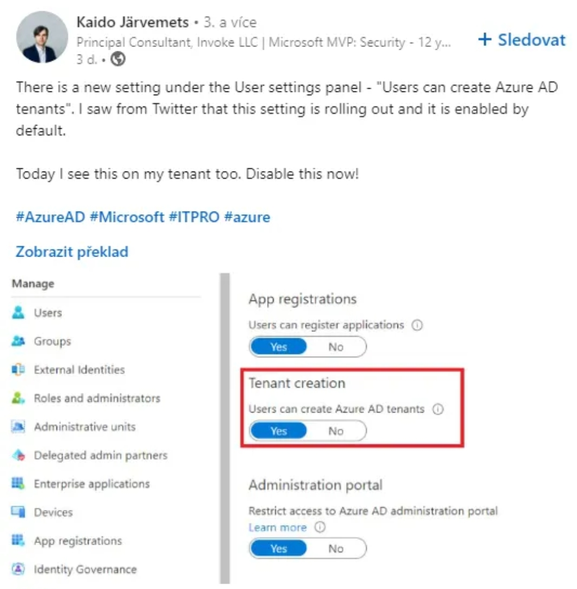
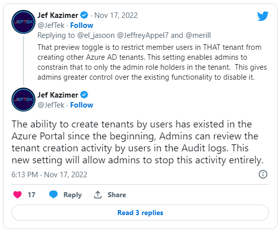
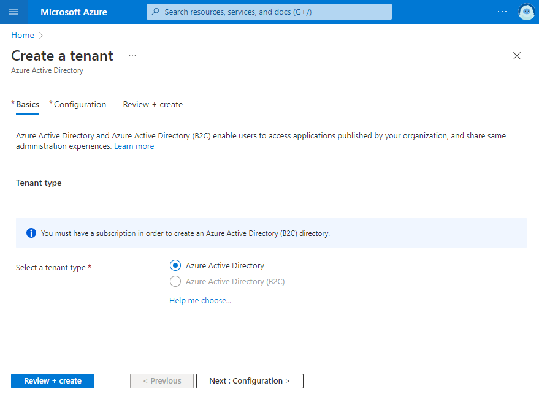
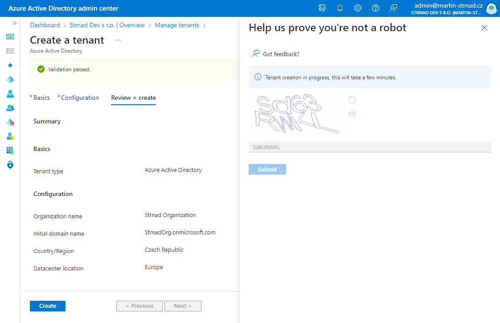
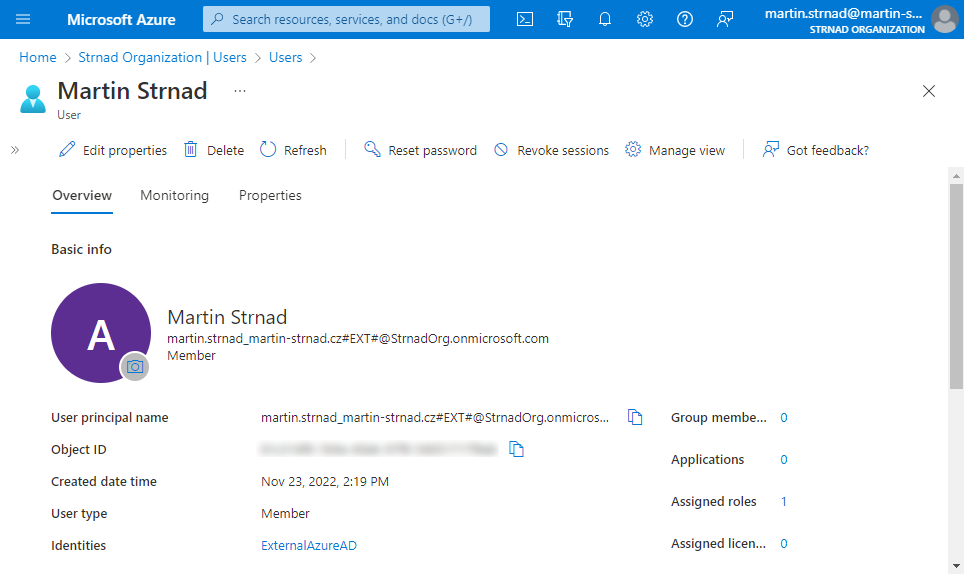
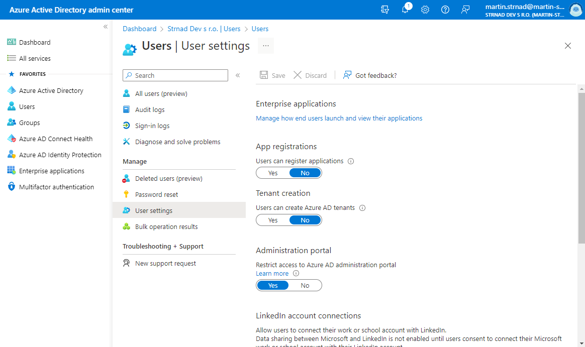
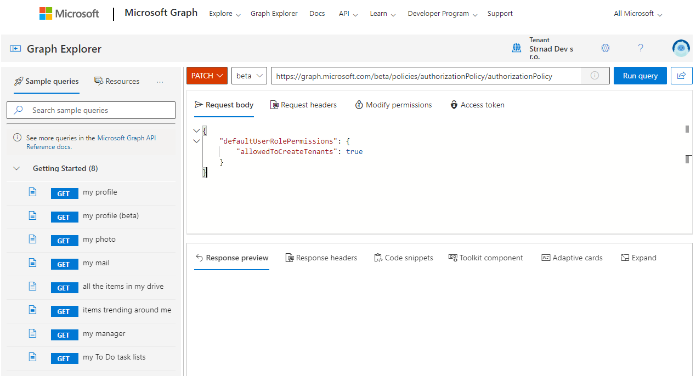
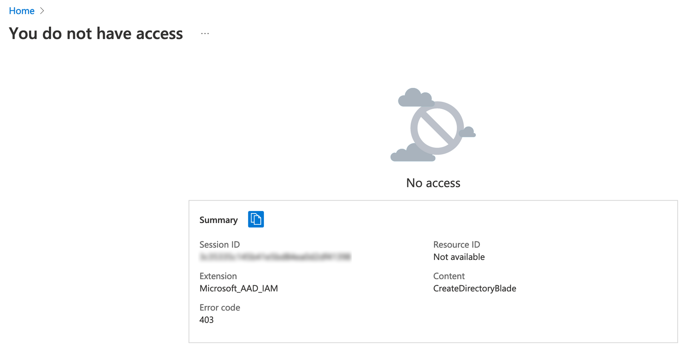

## New user setting that caused havoc

In november 2022, many folks from the Microsoft community pointed out that a new setting was added to Azure AD: "**Tenant creation** - Users can create Azure AD tenants".



You might think that Microsoft got crazy and as a part of the "Power to the people" cultural phenomenon, they created this option to give your users more freedom.


But the opposite is true. Since the beginning of Azure portal, every user could have accessed the Azure AD portal if not specified otherwise. And so each user could have created Azure AD tenant with his corporate account. Until today it was a big problem because admins had no setting to prevent it. Furthermore, the tenants created by your users are not in any way linked to the corporate tenant. You can see the proof of it below in the end user experience. With this new setting, the administrators of your tenant now have better control over this.

Jef Kazimer, a principal product manager at Microsoft ([@Jefftek](https://twitter.com/JefTek) on Twitter) stated on his twitter account that it was always the case and that the setting is there to finally give admins control over tenant creation using corporate identity.



## Creating Azure AD from a user's perspective

Since only a few of you created their own tenant, and those who did only did it once in their life, let me show you what the experience is like.

You may wonder how does one create a tenant, where do you start and how can anyone in your tenant find a way to create one. There are multiple ways a user can create a tenant. It turns out that a simple Google search for *Microsoft 365 tenant creation* leads you to a Microsoft documentation page - [Quickstart: Set up a tenant](https://learn.microsoft.com/en-us/azure/active-directory/develop/quickstart-create-new-tenant). In that documentation, there as a section called *Create a new Azure AD tenant* and there is a link to the [Azure Portal page](https://portal.azure.com/#create/Microsoft.AzureActiveDirectory) via which you can create a tenant. 



While going through the creation process, the user has to fill only few additional information like Organization name, initial domain name and country or region. Type of the tenant also has to be selected but often times, there will be one option available, because in order to select Azure AD B2C tenant, the company tenant has to have an Azure subscription associated to it.



After a while, a new tenant will be created. The user can now switch between the corporate tenant and his own tenant. The newly created tenant will have only one user associated to it. It'll be an *ExternalAzureAD* identity with a global administrator role associated to it.



In the corporate tenant, administrators can view the action in the *Audit Logs*. To view such action, look for a *Activity Type* of **Create Company**. They only get the information about the action, who created the tenant and from where, but not any information about the new tenant. Corporate administrator is not even able to switch to the newly created tenant. As you can imagine, administrators of the corporate tenant **may want** to prevent this from happening.

## Disable this option!

### Azure AD portal

There are 3 ways to disable the creation of new tenants using corporate identities. You can use the setting in Azure portal.

1) Go to [aad.portal.azure.com](https://aad.portal.azure.com)
2) Then go to **Users** > **User settings**
3) Under Tenant creation, switch from Yes to **No**
4) **Save** the setting



### PowerShell

If you are an administrator that likes to feel like a hacker, you can use PowerShell.

``` powershell
# Load module
Import-Module Microsoft.Graph.Identity.SignIns

# Connect to Microsoft Graph with permissions needed
Connect-MgGraph -Scopes 'Policy.ReadWrite.Authorization'

# to use allowedToCreateTenants option, you have to use beta version of the module
Select-MgProfile -Name beta

# Create an object params hashtable
$params = @{
	DefaultUserRolePermissions = @{
		AllowedToCreateTenants = $false
	}
}

# Update the default authorization policy using the created hashtable
Update-MgPolicyAuthorizationPolicy -AuthorizationPolicyId 'authorizationPolicy' -BodyParameter $params
```


### Graph API

For a bit less fancy administrators, there is a Graph API call you can use to disable this as well. Use the [Microsoft Graph Explorer](https://developer.microsoft.com/en-us/graph/graph-explorer), sign in as an administrator with sufficient permissions and send a PATCH request to the https://graph.microsoft.com/beta/policies/authorizationPolicy/authorizationPolicy endpoint with the following body:

``` json
{
	"defaultUserRolePermissions": {
		"allowedToCreateTenants": true
	}
}
```

The Graph Explorer should look like this:


## Result

Once the Azure AD tenant creation is disabled, user can't create any new Azure AD tenant using their corporate identity. Instead of getting the creation form when accessing the link in the Azure portal, they get the 403 error code seen bellow.



If you found this blog post helpful, consider subscribing to my mailing list. You will get notified once a new post is released or when something special is going to happen. You can also share this blog post using those new fancy buttons at the top of the blog post. NICE and EASY 😁