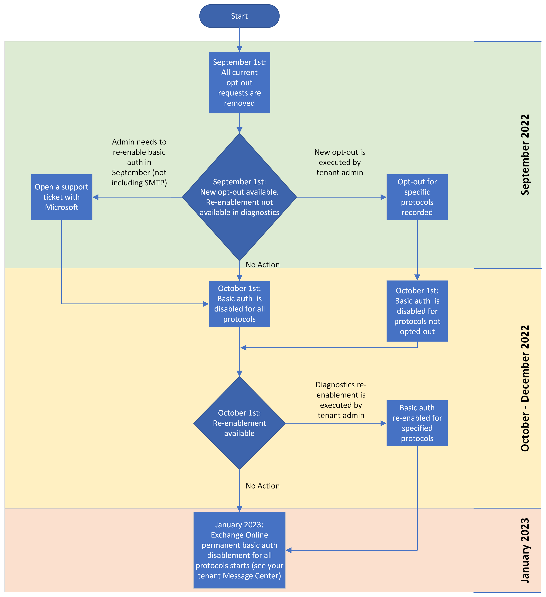
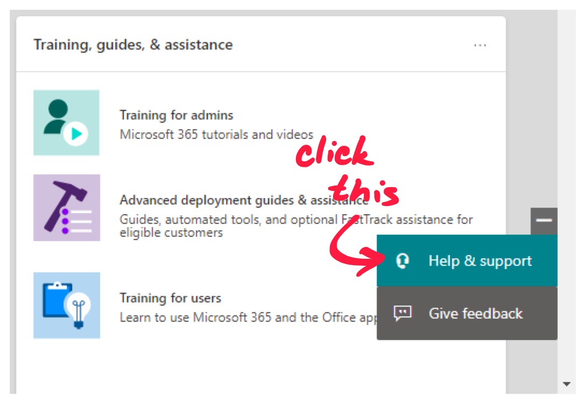
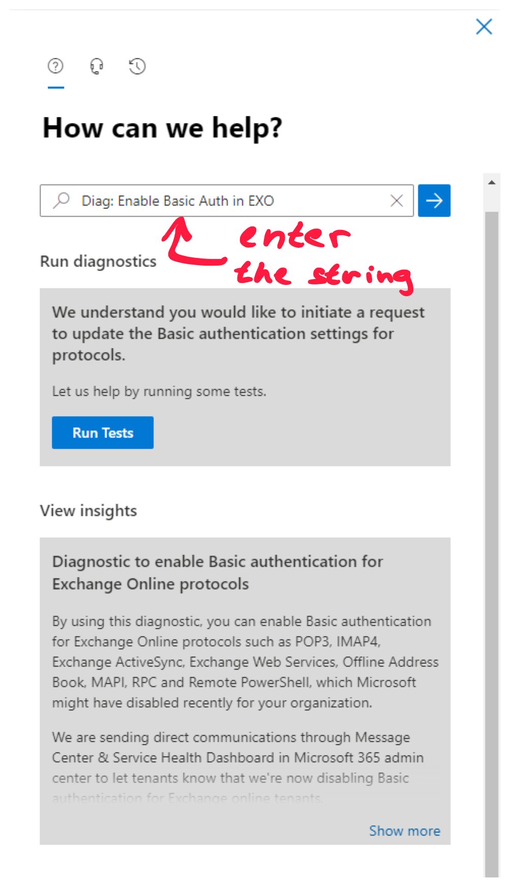
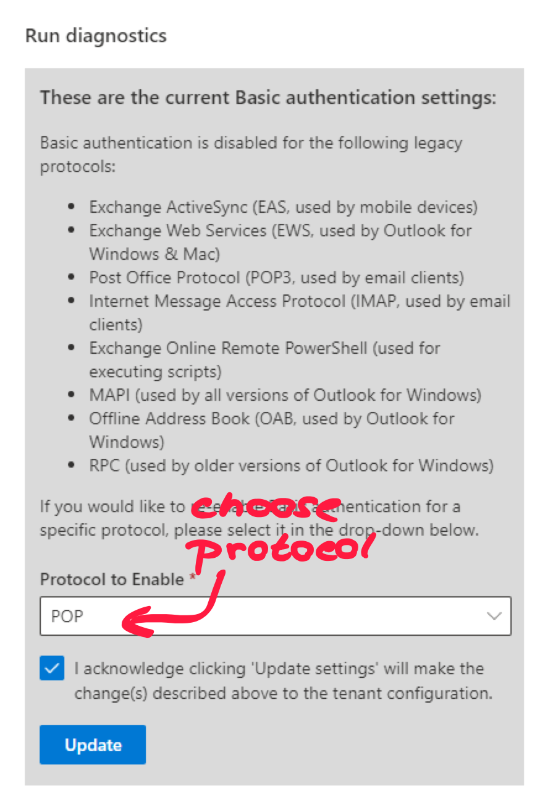
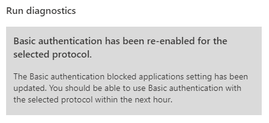

In 2021, Microsoft announced plans to disable all Basic Authentication and that they will start doing so on October 1, 2022.  Since then, they have begun turning the Legacy Authentication for tenants which they’ve determined are not using it. Without legacy authentication, many of companies using third-party email clients suddenly had a big problem. The POP3 or IMAP connections from their legacy email clients to Exchange Online were no longer responding.

They probably are not used to monitoring the message center and were unaware of this change. I'd say that Microsoft's determination of tenants not using Legacy authentication was not 100% perfect because some of our customers got it disabled even though they were using legacy authentication at that time.


And for those companies, that want a bit more time to upgrade their third-party email clients or other applications that use legacy authentication to access Microsoft 365 services, I have a TEMPORARY short-term solution.

What is more important, this will only help you for a limited amount of time, because Microsoft will disable legacy authentication to access Microsoft 365 globally at the start of January 2023. To see the exact time Microsoft will disable it in your tenant, see the [Message center in Admin Portal](https://admin.microsoft.com/Adminportal/Home#/MessageCenter).



## The only way

There is sadly only one way to re-enable legacy authentication and it is via a support request. To submit a file request for re-enabling the legacy authentication, follow the steps below.

1) Go to [**Admin Portal**](https://admin.microsoft.com/).

> Bare in mind that you have to be a **Global administrator** to submit such a ticket.

2) Click on the **Help and Support** button in the bottom right of your screen.



3) A panel will pop out on the right side of your screen. It will ask you to describe your problem. To start the process of re-enabling the legacy authentication, enter this string:
```
Diag: Enable Basic Auth in EXO
```
4) You should see a **Run diagnostics** option. Click the **Run Tests** button.


5) After a while, it will notify you which of the protocols have Basic Authentication turned off.


6) From the **Protocol to Enable** combo box, select which protocols you want to enable. 

> In the case of a third-party email client, you would probably want to enable POP and IMAP protocols. For mobile devices using legacy authentication, you might also want to enable Exchange ActiveSync.

7) **Check the box** that you acknowledge, that doing so will change the tenant-wide configuration. Then click **Update**.

Again, after a while, your setting will change and you should be able to use said protocols within the next hour.



By then, you should be good to use your email client for another month. Let me stress that it is really for only another month so you should consider changing to another email client or upgrading it to use modern authentication.

If this was helpful or you liked it, consider subscribing to my mailing list. You will get notified once a new post is released or when something special is going to happen. You can also share the post using the buttons at the top.

Have a nice day. 😉