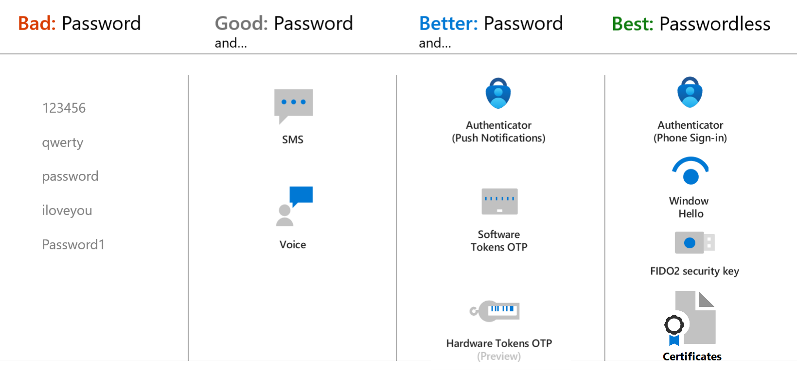
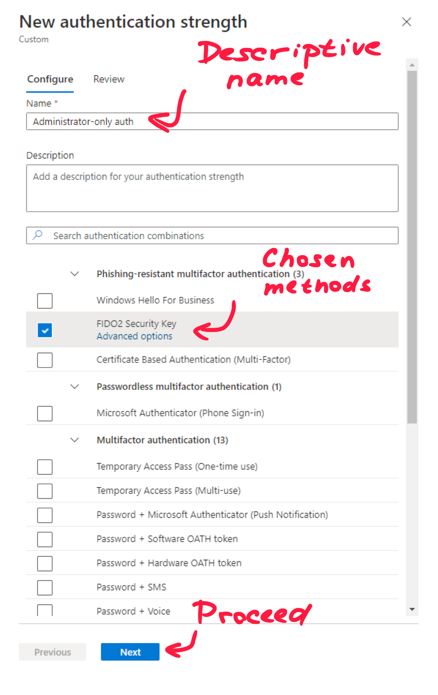
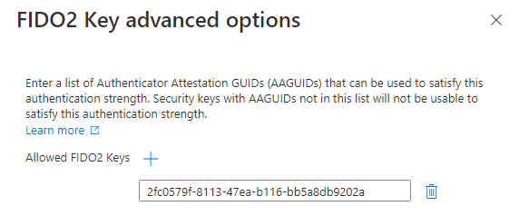
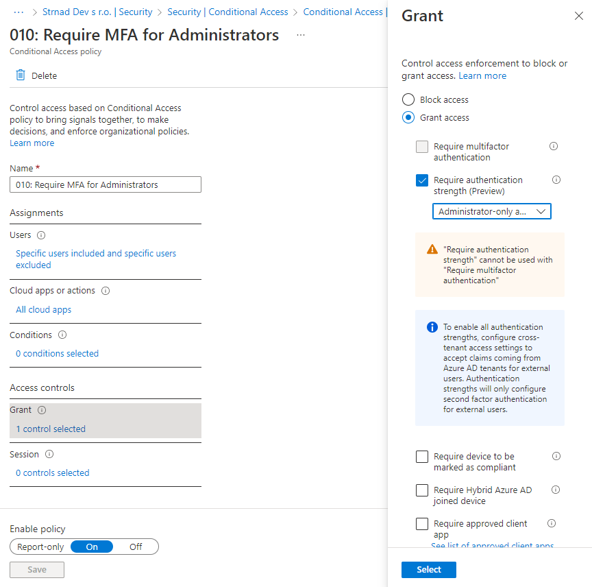
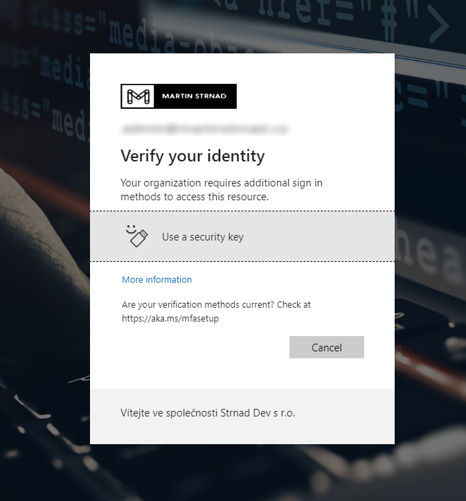

> Still in preview, do not use in a production environment.

On October 19, 2022, Microsoft announced new Conditional Access control, that allows administrators to specify which combination of authentication methods can be used to access a resource. This new control is called **Authentication strength**. The idea of requiring different authentication methods for differently sensitive apps or resources was around for some time. This control, for example, allows an administrator to allow any multifactor authentication (MFA) method to access most resources in your organization but requires strong, often phishing-resistant authentication methods when their users access a highly sensitive resource or business-critical application.

Now, let's talk about how this work. Authentication strength is based on the [Authentication methods policy](https://learn.microsoft.com/en-us/azure/active-directory/authentication/concept-authentication-methods). You can scope authentication methods for specific users and groups to be used across Azure AD federated applications.

## Built-in authentication strength groups

This policy defines which authentication methods are the most secure and determines 3 groups by their strength: **Multifactor authentication strength**, **Passwordless MFA strength**, and **Phishing-resistant MFA strength**. When granting access to the resource, you can require users to use methods from chosen Authentication strength group.

| **Authentication method combination** | **MFA strength** | **Passwordless MFA strength** | **Phishing-resistant MFA strength** |
|---|---|---|---|
| FIDO2 security key | ✅ | ✅ | ✅ |
| Windows Hello for Business | ✅ | ✅ | ✅ |
| Certificate-based authentication (Multi-Factor) | ✅ | ✅ | ✅ |
| Microsoft Authenticator (Phone Sign-in) | ✅ | ✅ |
| Temporary Access Pass (One-time use AND Multi-use) | ✅ |
| Password + something you have | ✅ |
| Federated single-factor + something you have | ✅ |
| Federated Multi-Factor | ✅ |
| Certificate-based authentication (single-factor) | |
| SMS sign-in | |
| Password | |
| Federated single-factor | |

## Custom authentication strength groups

In addition to the three built-in authentication strengths, you can create up to 15 custom authentication strength groups to exactly suit your needs. A custom authentication strength group can contain any of the supported combinations in the table above. To create a custom authentication strength group, follow the steps below.

1) Go to [Azure AD portal](https://aad.portal.azure.com)
2) Navigate to **Security** > **Authentication methods** > **Authentication strengths (Preview)**
3) Click **New authentication strength**
4) Fill in a descriptive name

> Preferably use a naming convention to stay consistent. For some reason, the name of the group cannot be longer than **30 characters**.

5) From the provided options, choose the ones you want to allow
6) Choose **Next** and then **Create**

To meet the needs of most administrators, you can further restrict the usage of some FIDO2 security keys based on their Authenticator Attestation GUIDs (AAGUIDs). An AAGUID is a 128-bit identifier indicating the authenticator type and must be provided during attestation. It allows administrators to require a FIDO2 key from specified manufacturers or even a series of Security tokens.

1) In the creation process, choose the **FIDO2 Security Key** option
2) Under the option, click **Advanced options**
3) specify AAGUIDs of supported Security Key manufacturers

> To find an appropriate AAGUIDs, visit the FIDO2 key manufacturer’s website

I prefer, like many others do, the Yubico devices. Be aware that not all of their devices support the AAGUID Identifier. To find your Yubikey AAGUID, visit [their website](https://support.yubico.com/hc/en-us/articles/360016648959-YubiKey-Hardware-FIDO2-AAGUIDs).

## Typical scenarios

After you determine the desired authentication strength, you'll have to create a Conditional Access policy to enforce chosen methods.

Typical scenarios:
- Require strong authentication method to access a sensitive data
- Require strong authentication method for privileged accounts
- Require a specific authentication when a user takes a sensitive action within an application (used with Conditional Access authentication context)
- Require more secure authentication for high-risk users
- Require specific authentication from guests who access a resource tenant

In the example below, I tried to apply the newly created authentication strength to all administrator accounts.

When an administrator tries to log into Microsoft 365 or other connected applications, he is required to use the FIDO2 Security key as an MFA method.

I personally think that this is a very nice addition to Conditional Access and I'm keen on seeing how you guys use this new feature. Let me know by tweeting [@strnad10](https://twitter.com/strnad10) or contact me via [LinkedIn](https://www.linkedin.com/in/strnad10/). Don't forget to share this post with others.

Until next time, have a wonderful time. 😊