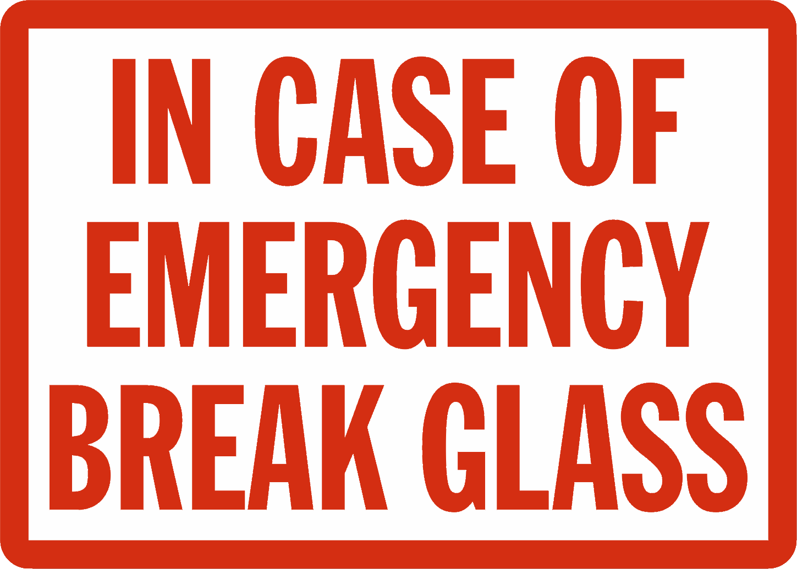
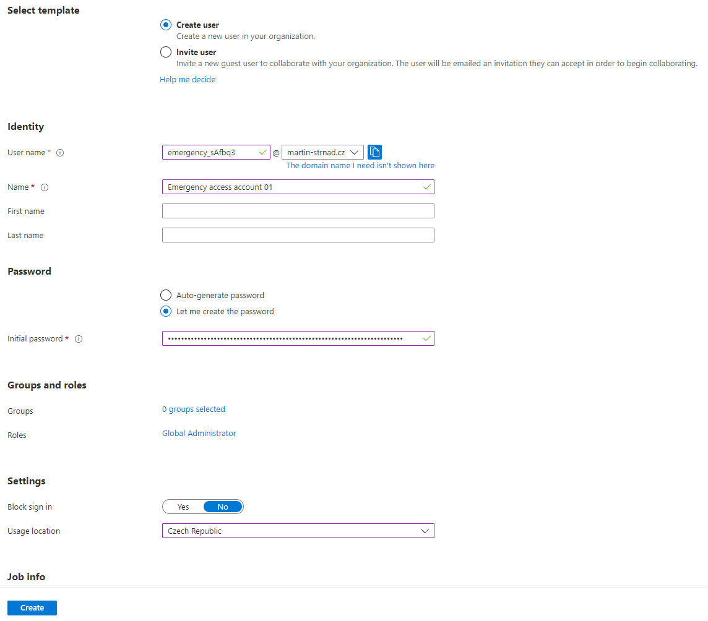

## You want them, this is why

In some of my posts, I mentioned something called Emergency access accounts. Emergency accounts are here to avoid the inconvenience of being locked out of your Azure AD and not being able to sign in or activate another user's account as an administrator.

Think of them like an emergency button in a school or a bank. In case of an emerging fire, you smash a big red button with an EMERGENCY sticker on it and the alarm starts. 

In some cases, they are also called Break-glass or Envelope accounts. It is essential to create two or more emergency access accounts in your environment. These emergency access accounts can be used in emergency situations when normal administrative accounts cannot be accessed, such as a security incident or conditional access outage. It's crucial to use these accounts only when necessary and not for regular usage. This way, you can limit the impact of accidental lack of administrative access.

Let me show you, how to create such an account and give you a few examples, of how to make your Emergency access accounts safer. 

## How to create such an account

1) Sign in to the [Azure AD admin center](https://aad.portal.azure.com) as an existing Global Administrator.
2) Go to Azure Active Directory > **Users**.
3) Select **New user** > **Create new user**.
4) Give the account a **User name** and a **Name**. See the [Naming convention](#naming-convention-for-emergency-accounts) chapter bellow
5) Create a complex and long password. 

> I've read a recommendation, that for those accounts, you should “Make the password 128 characters”. 128 characters are the maximum size for an Azure AD password, and it is advised to utilize it. The harder the password, the harder it will be for an adversary to hack it. I agree with the second statement but making the password 128 characters long is a bit overkill. In a state of emergency, you want to be fast and get to your environment in a reasonable time. That's why I would recommend **more than 60 characters**. Since this is not a regularly used account, there should be no complaints about the password length and also this password length is more than sufficient.

6) Under Roles, assign the **Global Administrator** role.
7) Under Usage location, select the appropriate location.
8) Then click **create**.

### Exclude one account from Conditional Access

When dealing with an emergency situation, make sure that you will not be blocked from accessing the necessary resources to resolve the issue. One way to do this is to exclude at least one emergency access account from all Conditional Access policies. This will allow you to bypass any restrictions that may be in place during the emergency.

### Exclude one account from phone-based MFA

To minimize the risk of an attack caused by a compromised password, Microsoft suggests that multi-factor authentication should be mandatory for all individual users. This includes administrators and any other users whose compromised accounts would have a significant impact.

However, it is important to note that at least one of your emergency access accounts should not use the same multi-factor authentication method as the non-emergency accounts. This applies to third-party multi-factor authentication solutions as well. If you have a Conditional Access policy that requires multi-factor authentication for all administrators in Azure AD and other connected SaaS apps, you should exclude emergency access accounts from this requirement and use a different authentication mechanism instead. Additionally, it is important to ensure that these accounts do not have a per-user multi-factor authentication policy.

## 4 main principles of break-glass account

There are 4 principles, that should be taken into consideration. 
1) It is important to ensure that they are not linked to any specific individual in the organization. This means avoiding using employee-specific devices or credentials, such as mobile phones or hardware tokens, to prevent being unable to access the account if that employee is unavailable. You can find more about storing account credentials safely in the [Safe place to store account credentials](#safe-place-to-store-account-credentials) chapter.

2) Use multiple means of communication with Azure AD. Use strong authentication methods for emergency access accounts that are different from those used for regular administrative accounts. To prevent external requirements, it's important to consider the dependencies of various authentication methods.

3) Ensure that the emergency access accounts are not expired or cleaned up due to lack of use.
4) Finally, make the Global Administrator role assignment permanent for these accounts in Azure AD Privileged Identity Management.

## Other recommendations

### Naming convention for emergency accounts

It is always a good practice to use a naming convention when creating administrator accounts. However, I would advise you all to use a different naming convention than you regularly use for other administrators.

I advise my customers to use a word like *emergency*, *breakglass* or *envelope* and a 6-character-long random string separated with an underscore. By randomizing the name of this account, you reduce the chance of guessing this account's credentials. It is up to you if you want to use the UPN or the default onmicrosoft.com domain.

The naming convention should look something like this:
- emergency_XXXXXX@contoso.onmicrosoft.com
- breakglass_XXXXXX@contoso.onmicrosoft.com
- envelope_XXXXXX@contoso.onmicrosoft.com

### Cloud-only emergency access accounts
I think that most of you already know that because this practice applies to all administrator accounts but to those who don't. This applies to all organizations that have a hybrid environment. All administrator accounts, including emergency access accounts, should be cloud-only identities. That means that administrator accounts should not in any circumstances be synchronized from on-premises.

### Safe place to store account credentials

To ensure the safety of emergency access accounts, organizations must keep their credentials secure and limit access to authorized individuals only. Some customers of mine use a FIDO2 security key for Azure AD or simply passwords. In cases where a password is used for these accounts, it's common to hide the password in a fireproof safe and form a well-documented process to access that safe.

### Monitoring sign-in activity is key

To ensure that emergency access accounts are only used for their intended purpose, organizations should monitor and track the activity on these accounts, such as sign-in and audit logs. This will allow administrators to detect any suspicious activity and take appropriate action. By monitoring them, organizations can verify that these accounts are only used in emergency situations or for testing purposes. 

Azure Log Analytics is often used to monitor sign-in logs and set up notifications, such as email or SMS alerts, to notify administrators when emergency access accounts are being used. I'll make a guide on how to monitor these accounts in the future so stay tuned for that.

### Train your staff and validate these accounts regularly
It is a good practice that you inform your SOC about the existence of those accounts and let them know about good practices they should follow.

Those practices are:
- They should regularly test these accounts.
- The process of using such accounts should be well-documented.
- Train them and also other administrators on the process to use the emergency accounts
- When you use those credentials, don't forget to update them
- Make sure that this account is not registered for SSPR

Your IT Staff should do the steps above at least every 90 days, when the IT staff changes (job change, a departure, or a new hire) or even when there is a change in the Azure AD subscriptions.

## Conclusion

I tried to give you as much insight into Break-glass accounts as possible. Most of those recommendations are based on my own experience with our customers. Some of them are also based on Microsoft's documentation and a few others are from a close friend of mine. I you want to show him some love, send him a message on [LinkedIn - David Horák](https://www.linkedin.com/in/david-hor%C3%A1k-012a75140/). 

You should also show some love to me by following me on LinkedIn or Twitter. If you have any questions or comments regarding emergency access to Microsoft 365, do let me know on the two platforms. 😊 

Until next time, have a nice time.
