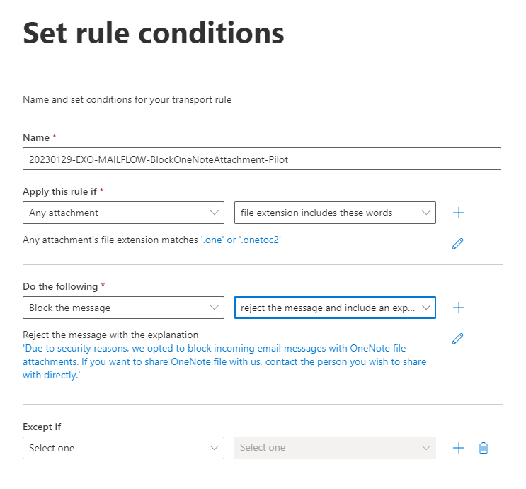

> **TL;DR:** New threat in form of OneNote files emerged as folks from Bleeping Computers informed in this post: [Hackers now use Microsoft OneNote attachments to spread malware](https://www.bleepingcomputer.com/news/security/hackers-now-use-microsoft-onenote-attachments-to-spread-malware). In this article, I give you a tutorial how to remediate this by a simple rule.

## Another threat to our users emerged 

Cybercriminals have started using OneNote attachments in phishing emails to infect victims with malware that can steal passwords, cryptocurrency wallets, and install more malware. This is a new tactic after previous methods, such as using macros in Word and Excel. They were disabled by default by Microsoft not so long ago. 

I think that this should be common sense nowadays but I don't think that's the case. To avoid falling victim to these types of attacks, it is important to **NOT** open files from unknown people, and to pay attention to warnings displayed by your operating system or applications like the one below when opening attachments.

You can read more on that in the article on Bleeping Computers [here](https://www.bleepingcomputer.com/news/security/hackers-now-use-microsoft-onenote-attachments-to-spread-malware/).

Let me give you a TL;DR version of their post. In December last year, [Trustwave SpiderLabs](https://www.trustwave.com/en-us/resources/blogs/spiderlabs-blog/trojanized-onenote-document-leads-to-formbook-malware/) warned that attackers started using OneNote attachments in spam emails to distribute malicious code. It might look something like this.

These OneNote files are built so that the content that should be interesting to the user is blurred out and in the middle is a button with a prompt to click on it. Behind the button are hidden .vbs scripts that will run after double-clicking on the button. Before running the script, Windows will give you a warning prompt but from the experience we know, that it will stop no curious user. 

This threat should not be overlooked. Cybersecurity researcher James confirmed in his Twitter post that attackers can install AsyncRAT and XWorm remote access trojans using OneNote files.

<blockquote class="twitter-tweet">Recent (since mid last month) .one files have been embedding naughty files:  .vbs .bat .exe .wsf .hta  that have been dropping <a href="https://twitter.com/hashtag/asyncrat?src=hash&amp;ref_src=twsrc%5Etfw">#asyncrat</a> and <a href="https://twitter.com/hashtag/xworm?src=hash&amp;ref_src=twsrc%5Etfw">#xworm</a>&mdash; James (@James_inthe_box) <a href="https://twitter.com/James_inthe_box/status/1615462827204186112?ref_src=twsrc%5Etfw">January 17, 2023</a></blockquote>

This post will give you fairly easy steps to disable .one file extension attachments directly in your Exchange Online. Right from the beginning, there are two ways you can go about it. You can either create a mail flow that will filter attachments and drop emails with .one attachment or you can create an anti-malware protection policy that will quarantine the message or reject it with a Non-delivery report message. The anti-malware policy will, however, block like 50 file types at once and as of writing, I couldn't find any way to customize such a list of file types to block explicitly only OneNote files. Because of that, I will show you only the mail flow method and I'll give you a link to the other method.

## Block .one using mail flow

This method is fairly straightforward. The first thing to do is to go to the [Exchange Online admin center](https://admin.exchange.microsoft.com/) and then follow the steps below.

1) In the menu on the left side, select **Mail flow** and go to **Rules**.
2) Create a new rule by clicking **+ Add a rule**.
3) Then click **Create a new rule** from the drop-down.
4) Give the rule an appropriate **Name**.

I hope that every one of you already has a naming convention so use it. If you don't have a naming convention for rules like this, use the example below: 
`20230129-EXO-MAILFLOW-BlockOneNoteAttachment-Pilot`

5) Set the *Apply this rule if* to **Any attachment** and **file extension includes these words**.
6) You will have to specify the OneNote file extensions. The extensions to specify are **one** and **onetoc2**. Make sure that you do NOT precede these with a dot.

The .onetoc2 file is a binary representation of the Table of Contents for keeping an index about the ordering of different note-taking sections in a .one notebook. That means that the .onetoc2 is not necessary to include in the list.

7) Set the *Do the following* to **Block the message** and **reject the message and include an explanation**.

This can be set to basically whatever suits your organization's needs. I used the setting with this message: 
'Due to security reasons, we opted to block incoming email messages with OneNote file attachments. If you want to share a OneNote file with us, contact the person you wish to share with directly.'

5) Click **Next**
6) You can further modify this mail flow rule at the *Set rule settings* page.
7) Set the *Rule mode* to **Enforce**.

I would recommend testing this setting beforehand in any other mode.

8) Set the *Severity* to suit your needs. 

I'd set it to **Low** and monitor these alerts regularly. If you identify a malicious domain, you can always block it.

9) Set the *Match sender address in message* to **Envelope**.

The reason for the Envelope value is that if you don't have any email security (in particular DMARC - more on that topic [here](https://martin-strnad.cz/010-email-security)) in place, the sender address in the email's Header can be relatively easily spoofed and can be different from who the sender actually was. 

10) **Review** and **Finish** the rule

The final rule should look something like this.

11) Last thing to do is to enable the rule. Click on the rule in the list and switch the *Enable or disable rule* switch to **Enable**.

As you can already tell, this rule will politely decline the message containing OneNote attachments and tell the user to arrange a different method of sharing.

Let me know if this was helpful to you or if you find the article interesting. 😊 One last thing before you go. Please, go to your social media and share this post with your friends so more people get to know about what I do. I’d really appreciate that. Until next time, have a wonderful day.
