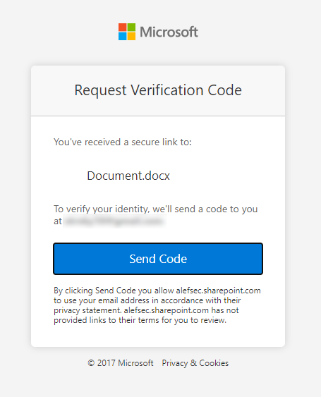
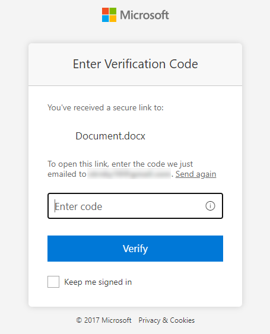
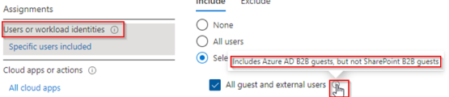
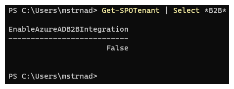
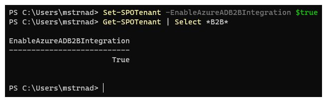
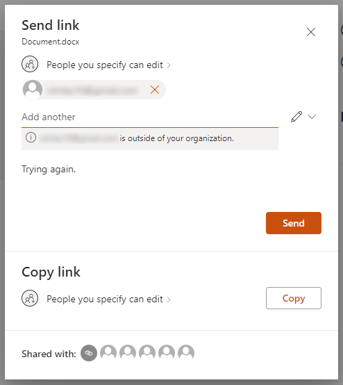
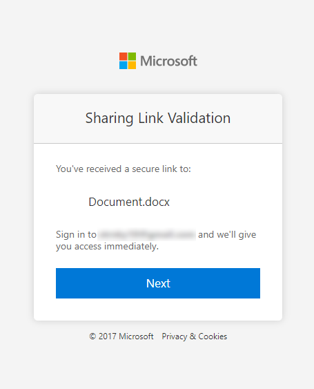
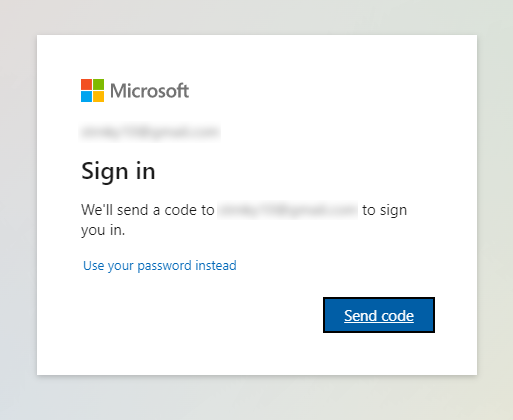
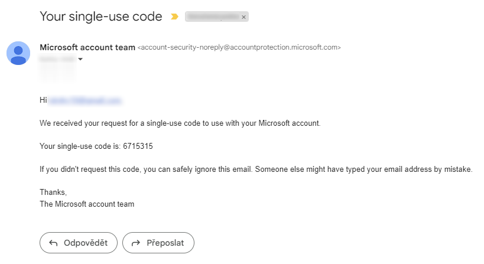
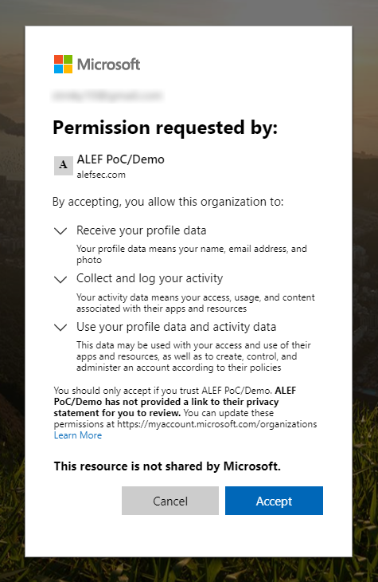

## The problem with sharing

Some of you may already know that there is something called SharePoint Online B2B guest. For those of you that don't, this post will give you an idea about the differences between SharePoint Online B2B guest users and Azure AD B2B guest users. By default, SharePoint Online creates its own SharePoint B2B guests instead of Azure AD B2B guest accounts when a document is shared. This could lead to low-security levels and can bypass Conditional Access policies. I'll also provide steps to enable Azure AD B2B integration within SharePoint Online and one-time passcodes to ensure that an Azure AD B2B guest user is created. I also included scenarios to understand the differences in user experiences before and after enabling these features.

## Your identity is not as centralized as you might think

Currently, many organizations use Microsoft Teams for collaborating and working together. It may work well and can be secured using various security measures offered by Microsoft's cloud security features, such as Conditional Access. However, when it comes to collaborating on a single document or folder stored on SharePoint Online or OneDrive for Business, sharing it through these platforms does not automatically create a guest account in Azure AD. Instead, it creates a SharePoint Online guest account, which is not an Azure AD B2B account. Although the document will be shared and accessible to the person you've shared it with, the SharePoint B2B Guest account used for this purpose will not be subject to Conditional Access. This is because you have created a SharePoint B2B Guest account instead of an Azure AD B2B account, which means that your security may not be as good as you thought.

Currently, many organizations use Microsoft Teams for collaborating and working together. This tool works well and can be secured using various security measures offered by Microsoft's cloud, such as Conditional Access. However, when it comes to collaborating on a single document or folder stored on SharePoint Online or OneDrive for Business, sharing it through these platforms does not automatically create a guest account in Azure AD. Instead, it creates a SharePoint Online guest account, which is not an Azure AD B2B account. Although the document will be shared and accessible to the person you've shared it with, the SharePoint B2B Guest account used for this purpose will not be subject to Conditional Access. This is because you have created a SharePoint B2B Guest account instead of an Azure AD B2B account, which can compromise security.

In some cases, not having this integration enabled may result in an organization will not comply with the local law. To give you an example, having this turned off in the Czech Republic means that you do not comply with Act No. 181/2014 Coll. of July 23, 2014, on Cyber Security and Change of Related Acts which requires you to have a single centralized identity provider.

## Experience without Azure AD B2B Integration

As mentioned earlier, by default SharePoint Online utilizes its own SharePoint B2B Guests experience. Here's how it works:

When a user shares a document or folder via SharePoint Online, they provide permissions and enter the email address of the desired SharePoint B2B Guest user who needs access. Once sent, the SharePoint B2B Guest user receives an email to go to the document and can click on it to open it in Word Online. In the browser, the SharePoint B2B Guest user can hit _Send Code_ to use the one-time passcode functionality. 



The verification code is sent to the same email address used to share the document. It's important to note that this process only uses email as a single-factor authentication, not multi-factor authentication.



After entering the one-time passcode received by email and clicking 'Verify', the Word document will be opened in Word Online. However, this process creates a SharePoint B2B Guest user instead of an Azure AD B2B guest user.

Since these SharePoint B2B Guest users bypass all Azure Active Directory policies, such as Conditional Access and Access Reviews, their security level is relatively low. As seen in the image below, when selecting 'All guests and external users', it only applies to Azure AD B2B guests and NOT SharePoint B2B Guests. This will soon change due to a new preview feature that you may read more about in this documentation: [Assigning Conditional Access policies to external user types (preview)](https://learn.microsoft.com/en-us/azure/active-directory/external-identities/authentication-conditional-access#assigning-conditional-access-policies-to-external-user-types-preview)



Now let’s have a look at how we can improve this to make sure that once users are invited from SharePoint Online or OneDrive for Business an Azure AD B2B guest user is created. This will guarantee that all users invited from that point on will receive an Azure AD B2B Guest account, hitting your configured Conditional Access policies for guest accounts.

## Enabling Azure AD B2B Integration and one-time passcodes

To ensure that SharePoint Online is respecting the Azure Active Directory B2B configuration, two settings need to be addressed. The initial setting is the Azure AD B2B Integration, which can be enabled from within SharePoint Online.

First, you need to install the SharePoint Online PowerShell module, then connect to the SharePoint Online environment. 

```PowerShell
Install-Module -Name Microsoft.Online.SharePoint.PowerShell -Force
Connect-SPOService -Url https://contoso-admin.sharepoint.com
```

> NOTE: Don't forget to run the PowerShell session as an administrator and also substitute your real tenant name into the URL.

Before we make any changes, it is necessary to examine the current configuration using the PowerShell command below:

```PowerShell
Get-SPOTenant | Select *B2B*
```



As you can see the 'EnableAzureADB2BIntegration' setting is set to false, which means SharePoint Online will not take into consideration the Azure AD B2B configuration which is in place. To enable this setting, run the following PowerShell commands in the same session:

```PowerShell
Set-SPOTenant -EnableAzureADB2BIntegration $true

# check for the change
Get-SPOTenant | Select *B2B*
```



The PowerShell might give you this warning: _Make sure to also enable the Azure AD one-time passcode authentication. If it is not enabled then SharePoint will not use Azure AD B2B even if EnableAzureADB2BIntegration is set to true._

This means you need to verify if the one-time passcode functionality is enabled in Azure AD. If it is not enabled, your SharePoint behavior will stay the same. You won’t get Azure AD B2B guest users but still SharePoint B2B Guest users.

1) To check this setting go to the [Azure Active Directory](https://aad.portal.azure.com/).
2) Click __External Identities__ in the left menu
3) Click __All Identity Providers__.

As you can see by default Azure Active Directory supports the use of guest accounts from other Azure Active Directories and (Personal) Microsoft Accounts. You are however able to add others, like integration with Google or Facebook. Doing so will mean users from the integrated services won’t use the one-time passcode functionality as these are trusted and 'federated' against their Identity Provider.

4) In the _Configured identity providers_ Click the  __Email one-time passcode__ functionality.
5) A panel on the right will pop up. Ensure the switch is set to __Yes__, indicating this functionality is enabled.

> This functionality is enabled by default in every tenant that did not choose otherwise since October 2021.

## The new experience with Azure AD B2B Integration enabled

In the steps above, we enabled the Azure AD B2B integration and made sure that an Email one-time passcode is enabled for guest users. Let's see if the behavior changed.



The experience from the start looks the same. You receive an email from the one who shared the document with a link to access the document. Once you click on the link, it will take you to the same sharing validation screen.



When you click __Next__, you will be redirected to a well-known login screen that will let you receive a one-time passcode.



Once you click the __Send code__ button, you will get an email from the Microsoft account team with the one-time passcode. The email itself is also a bit different than the one you received before.



When you copy the code to the login screen, you are prompted with a screen below that wants your consent. When accepted, the Azure AD of an organization that is sharing with you will get access to information from your personal account. 

> Your experience may warry in this step when using other than a personal account



When given permission, Azure AD will make you a guest account in the organization that is sharing with you and you may then be subjected to Conditional Access policies. Now if you did configure an Azure Active Directory Conditional Access Policies for your guest users, which i.e. enforces MFA, the user gets prompted to enroll for Azure Multi-Factor Authentication for his Guest account. What is more important, by doing this you will get a single centralized identity provider.

Once the process is finished, you will get access to the shared document. Keep in mind that the guest user will not have to do this every time he accesses the shared document. Some actions shown above are one-time settings.

## Frequently asked questions about the integration

### What happens to my current SharePoint B2B Guest users?

After their next sign-in, they will use the Azure Active Directory (Azure AD) B2B one-time passcode functionality instead of the SharePoint Online one. This means that users will be converted to Azure AD B2B guest users only after a successful sign-in, triggered by the user themselves. This change may result in additional security measures for users, such as multi-factor authentication (MFA) via Conditional Access or Access Review over time. Shared documents or folders do not need to be shared again.

### Will this affect my existing Azure AD B2B guest users, such as Microsoft accounts or others?

No, enabling the Azure AD B2B Integration from SharePoint Online only applies to SharePoint Online and OneDrive for Business. The change ensures that the Microsoft accounts and Azure AD accounts of the particular users are used to sign in and open the document instead of SharePoint B2B Guest accounts.

### Will my Azure AD B2B guest or Microsoft guest account use the one-time passcode functionality?

No, these identities will use their own External Identity Provider configured within the External Identities blade. The one-time passcode functionality is only used when an Identity Provider isn't listed.

### Can I add other Identity Providers?

Yes, you can add others such as Facebook, Google, or Google Workspace from the External Identity Provider screen. However, this needs to be enabled by an Administrator.

### Does this impact licensing?

It depends. If you haven't enabled the 'Linked subscriptions' feature under the External Identities blade, the ratio is 1:5 (i.e., one Azure AD Premium license allows five guests who use that functionality). If you have enabled the 'Linked Subscriptions' feature, the first 50,000 monthly active guest users are free, and any additional guests will be billed based on your linked Azure Subscription.

### Can we enforce Azure AD B2B sign-in only and block one-time passcodes?

No, disabling the one-time passcode functionality in Azure AD means that SharePoint Online will not respect the Azure AD B2B policy. Instead, it will use its one-time passcode behavior, resulting in a SharePoint Online B2B Guest user. You can choose to block external sharing within SharePoint Online/OneDrive for Business to prevent Azure AD B2B and SharePoint Online B2B Guest users, resulting in no one-time passcode. However, this may have a significant impact on your business.

I hope you found this blog post interesting. If you did, share it with your friends and colleagues. If you have any questions regarding Microsoft 365, do let me know on LinkedIn or Twitter, I'll be happy to help.

Have a wonderful time. 😊