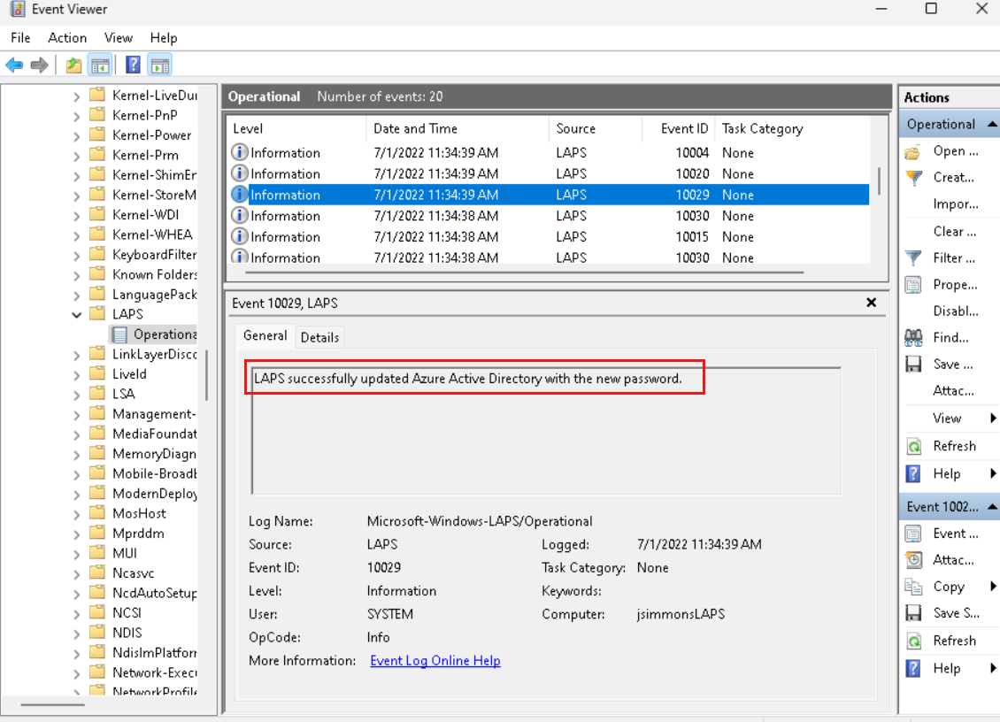
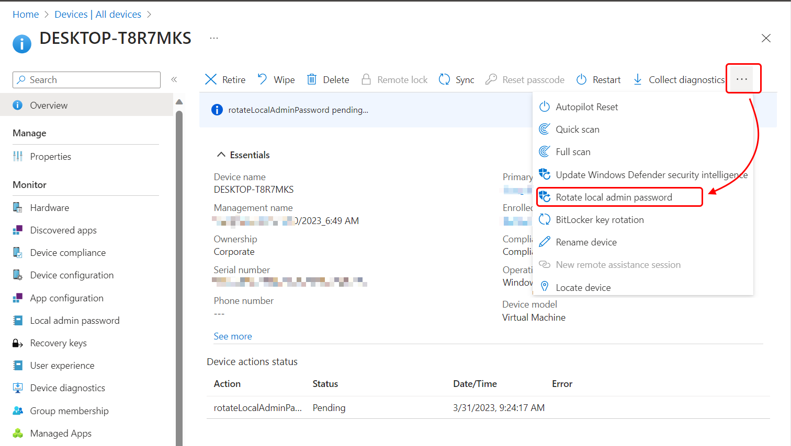
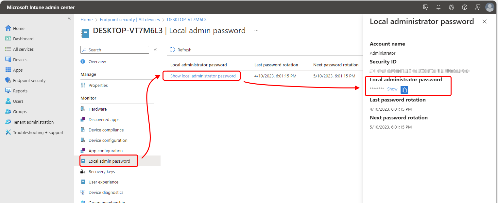

> Windows LAPS with Microsoft Entra (Azure AD) and Microsoft Intune support is now in public preview as of April 21st, 2023. Do not use it in production environments.

## Why use LAPS

You would not believe it! It happened. Azure AD can now back up and retrieve passwords from Windows LAPS. Bear in mind, that it is still in preview but man, I can't wait to roll this out to our customers.

For those that do not know what LAPS is and why you would want to use such a thing, here’s a quick summary.

Windows LAPS is a valuable tool for enhancing security in Windows environments. It automates the management, retrieval, and rotation of local administrator account passwords, reducing the risk of unauthorized access and password-based attacks. By providing granular access control and auditing capabilities, it ensures that only authorized personnel can retrieve passwords and maintains compliance with security standards. Windows LAPS integrates seamlessly with existing infrastructure and now also with Azure AD, making it a practical solution for almost everyone type of organization.

## Prerequisites

The only prerequisite I know of is the Windows OS, which must be on a specific supported version. The versions are:

- Windows 11 22H2 - April 11 2023 Update
- Windows 11 21H2 - April 11 2023 Update
- Windows 10 - April 11 2023 Update
- Windows Server 2022 - April 11 2023 Update
- Windows Server 2019 - April 11 2023 Update

Bear in mind that your devices have to be at least Azure AD-joined. 

Licensing-wise, Windows LAPS for Azure AD is available to all customers with Azure AD Free or higher licenses.

To play with the functionality, you have to have one of the built-in Azure AD roles which are Cloud Device Administrator, Intune Administrator, or Global Administrator. For those folks that obey the least privilege principle, there is an option of creating your role with desired permissions. Assign the microsoft.directory/deviceLocalCredentials/password/read permission to the custom role to authorize local administrator password recovery.

> During the preview, you must create a custom role and grant permissions using the Microsoft Graph API or PowerShell. Then assign the role to specified users.

You can also create an Azure AD administrative unit, add devices, and assign the Cloud Device Administrator role scoped to the administrative unit to authorize local administrator password recovery.

To implement Windows LAPS, you have to do 3 steps. First, you need to choose a deployment mechanism to deploy Windows LAPS, then you need to understand policies that apply to Azure Active Directory mode and lastly, you configure the policies themselves.

## Choose a deployment mechanism

As previously mentioned, you have to choose how to apply the LAPS itself. If you have Azure AD-Joined devices, the best option for you would be to use Microsoft Intune.

However, if you have Hybrid Azure AD-Joined devices and you’re not using Microsoft Intune yet, you’re in luck too. You can deploy policies by using GPOs.

For those of you, that have Azure AD-Joined devices and not using Microsoft Intune, there is an option of setting this up manually either via direct registry modification or by using Local Computer Group Policy.

## Understand policies affecting Azure AD mode

There is a subset of Windows LAPS CSP policies and Windows LAPS Group Policy object that manage the same setting. However, only a subset of these settings applies to Windows LAPS in Azure mode because the Windows Server Active Directory-specific policy settings don't make sense, and aren't supported, when backing the password up to Azure Active Directory.

These settings are applicable to Azure AD mode for managing LAPS:

-   BackupDirectory
-   PasswordAgeDays
-   PasswordComplexity
-   PasswordLength
-   AdministratorAccountName
-   PostAuthenticationResetDelay
-   PostAuthenticationActions

## Configure the policies

There is at least one policy to set and it is the BackupDirectory. Set its value to 1 to backup passwords to Azure Active Directory.

If you don't set the AdministratorAccountName value, Windows LAPS will automatically manage the default built-in local administrator account. This account is identified using a well-known relative identifier (RID) and should never be identified by its name. The name of the built-in local administrator account can vary depending on the device’s default language. If you want to configure a custom local administrator account, you should set the AdministratorAccountName value to the name of that account.

Feel free to configure other settings, such as PasswordLength, according to your organization's requirements.

## Speed up the policy processing

Windows LAPS regularly checks the active policy at intervals of one hour. However, if you don't want to wait for the next scheduled check, you can manually trigger the policy update using the Invoke-LapsPolicyProcessing PowerShell cmdlet.

To confirm that the password has been successfully updated in Azure Active Directory, check the event log for the occurrence of the 10029 event.



## Rotate the password manually

Windows LAPS keeps track of the expiration date of the last stored password on the local system. When the password reaches its expiration, Windows LAPS automatically rotates it. However, there may be cases where you need to rotate the password ahead of schedule, such as after a security breach or for ad-hoc testing purposes. In such situations, you can manually initiate a password rotation using the Reset-LapsPassword cmdlet. Here's an example of how to use it:

``` Powershell

Reset-LapsPassword
Get-LapsAADPassword -DeviceIds myAzureDevice -IncludePasswords -AsPlainText

```

And the output of it is:

``` Output
DeviceName             : myAzureDevice
DeviceId               : be8ab291-6307-42a2-8fda-2f4ee78e51c8
Account                : Administrator
Password               : &HK%tbA+k7,vcrI387k9([f+%w)9VZz98;,(@+Ai6b
PasswordExpirationTime : 7/31/2022 12:16:16 PM
PasswordUpdateTime     : 7/1/2022 12:16:16 PM
```

You can also use Microsoft Intune to rotate the password. Just go to the device's details and on the Overview page, click the triple dots and then **Rotate local admin password**.



## Retrieve the password

You can retrieve Windows LAPS passwords stored in Azure Active Directory by utilizing Microsoft Graph. To simplify this process, Windows LAPS offers a PowerShell cmdlet called Get-LapsAADPassword, which serves as a wrapper for the Microsoft Graph PowerShell library. Additionally, you have the option to use the Azure AD and/or Intune management portals for a password retrieval experience with a graphical user interface. However, please note that Windows LAPS does not provide any built-in user interface options within Windows itself for retrieving Azure Active Directory passwords.



I hope that you find my posts helpful. One last thing before you go. Please, share this post with your friends so more people get to know about what I do. I’d appreciate that. 

Have a wonderful day wherever you go. 👋