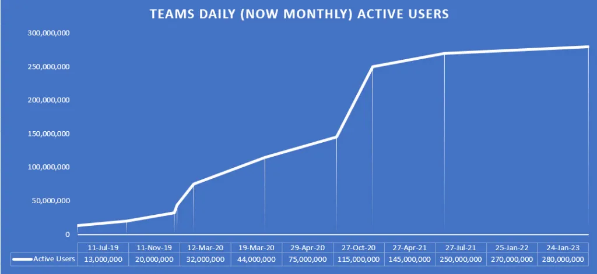

## Yet another bug in Microsoft Teams has emerged

Security experts have uncovered a straightforward method to distribute malware to an organization through Microsoft Teams, even though the application has implemented restrictions on files originating from external identities.

Microsoft Teams, a communication and collaboration platform integrated into the Microsoft 365 is a widely used platform with a user base of more than 280 million monthly active users.

Max Corbridge and Tom Ellson are a members of a Red Teams at Jumpsec — a security-oriented company. They examined the inner workings of Microsoft Teams and they successfully identified a means to transmit malware by exploiting a non-affiliated account within the target organization. 

## The attack is fairly straight forward

The method of attack exploits the default setup of Microsoft Teams, which permits communication between the application and external accounts.

According to the report written by Corbridge and Ellson, this communication channel alone would be sufficient for social engineering and phishing attacks. However, the discovered method is even more dangerous as it enables the direct delivery of a malicious payload into the target's inbox. To prevent the delivery of files from external tenant accounts, Microsoft Teams implements protections on the client side. Nevertheless, the Red Team members from Jumpsec managed to circumvent this restriction by manipulating the internal and external recipient IDs in a POST request for a message. This manipulation fools the system into treating an external user as an internal one.

In this attack scenario, the payload is hosted on a Sharepoint domain, and the target unknowingly downloads it as a file within their inbox, rather than as a link. The researchers at Jumpsec successfully tested this technique in real-world scenarios. They delivered a command and control payload to the target organization's inbox in a governed Red Team activity.

This attack method evades existing security measures and anti-phishing training recommendations, providing attackers with a relatively straightforward means to infect any organization utilizing Microsoft Teams with its default configuration.

> The important thing to point out is the "default configuration". There is a remediation step you can take to mitigate this issue. More bellow!

## Do not expect a quick fix from Microsoft's side

Microsoft was immediately notified about the issue. Although they acknowledged the existence of the vulnerability, their response indicated that it did not meet the criteria for immediate fix. BleepingComputer reached out to Microsoft to ask them about the issue and their plans for resolving it. By the time of publishing this post, Microsoft did not respond yet.

For organizations using Microsoft Teams that do not require regular communication with external tenants, I recommend to disable this feature through the "Microsoft Teams Admin Center > External Access" settings. If you need to communicate with external entities, I recommend you to actively maintain your Teams channels. Organizations can mitigate the risk of exploitation by specifying trusted domains in an allow-list in Azure AD which we also highly recommend. The process of establishing a relationship with external companies can be automated through Power Platform. I might also do a quick post about it in the future so stay tuned for that. 

I'd love Microsoft to do something with this issue as fast as possible. Fortunately, the researchers from Jumpsec have submitted [a request to include logging for events](https://feedbackportal.microsoft.com/feedback/idea/16fe3111-4410-ee11-a81c-000d3a7a48db) related to external tenants in the software. This addition could aid in the prevention of attacks as they unfold. It would be lovely from you to vote up for this request.

And you know what would also be lovely? If you like the post, go to your social media and share this post with your friends. I’d really appreciate that. ❤️ 

Have a wonderful weekend. 👋