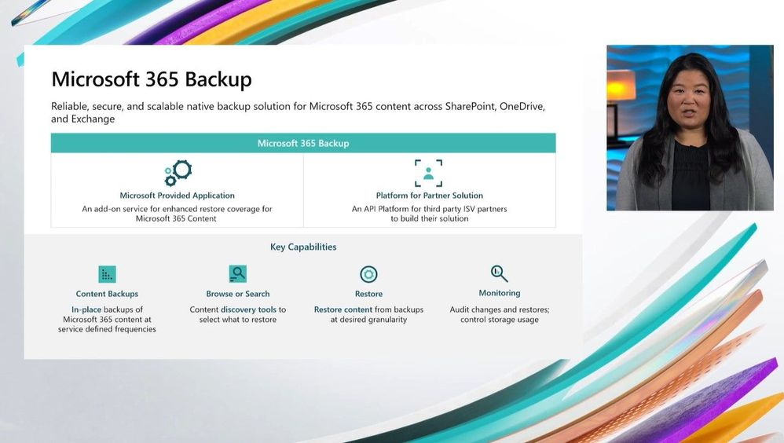
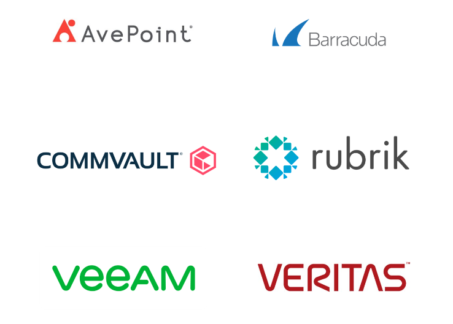

## Microsoft 365 native backup solution is almost here!

Tons of documents and emails are added to Microsoft 365 every day. However, much of this content is unstructured, and traditional manual processing and management methods are no longer effective when dealing with such large volumes.

As your content continues to grow, ensuring its protection throughout its lifecycle and maintaining optimal availability while managing costs becomes increasingly crucial and also difficult.

To address these challenges, Microsoft is introducing __Microsoft 365 Backup__ and __Microsoft 365 Archive__ at Microsoft Inspire event. You can find more information in this [featured session](https://inspire.microsoft.com/en-US/sessions/b684cbdf-80bd-45f2-8f75-e00e606b7a6c?source=sessions) from Microsoft Inspire.

## Meet Microsoft 365 Backup

Let's start with Microsoft 365 Backup first. 

With the increasing frequency of ransomware encryption attacks and security breaches, organizations are recognizing the significance of prioritizing cybersecurity measures to protect their data and sensitive information. Ensuring compliance with regulatory requirements has become essential for them.

To address these concerns, Microsoft 365 Backup offers a solution for recovering data from OneDrive, SharePoint, and Exchange Online at as they say: '__UNPRECEDENTED SPEEDS__', even when dealing with large data volumes. The restore service level agreement (SLA) guarantees a reliable and efficient recovery process, all while maintaining data security within the Microsoft 365 environment.

Key features of Microsoft 365 Backup include:
- Backing up entire or selected SharePoint sites, OneDrive accounts, and Exchange mailboxes within your organization.
- Efficiently restoring files, sites, and mailbox items to specific points in time either in a granular manner or on a massive scale.
- Simplifying the process of searching and filtering content within backups using relevant metadata like item or site names, owners, or event types within specific restore points.

Microsoft 365 Backup can be conveniently accessed through the Microsoft 365 admin center. Alternatively, organizations can opt for partner applications built on top of Microsoft's Backup APIs. This choice allows them to leverage the benefits of this technology while also backing up non-Microsoft 365 data or working with their preferred partners.

These partner applications offer seamless experiences for both Microsoft 365 and non-Microsoft 365 data sources, all within a single, unified interface. Additionally, these partner apps benefit from the same efficient backup and restore speeds, backed by Microsoft's reliability assurances, while ensuring that Microsoft 365 data remains secure and compliant.

And now DRUM ROLL, please! 🥁🥁

__The public preview of Microsoft 365 Backup is scheduled to be available in the fourth quarter of this year.__

## Closing words

There is not much more information than on Microsoft's Tech Community Forum. We'll have to wait and see what the retention will be, how fast will the restore really be, WHAT IS THE COST OF THE SERVICE and other questions we all surely have.

I also have a short article about Microsoft 365 Archive prepared for you, so stay tuned for that.

One last thing before I let you go. Please, go to your social media and share this post with your friends so more people get to know about what I do. I’d appreciate that. Have a wonderful day. 😊