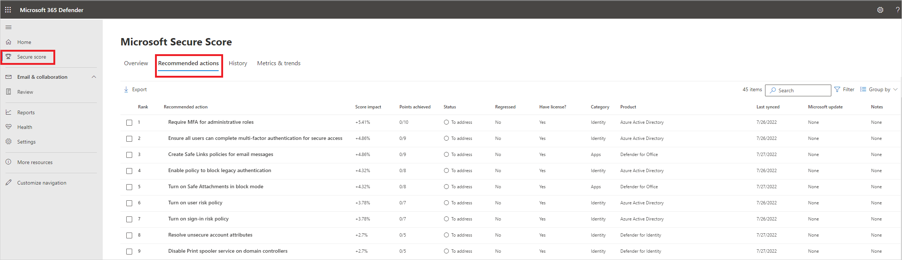
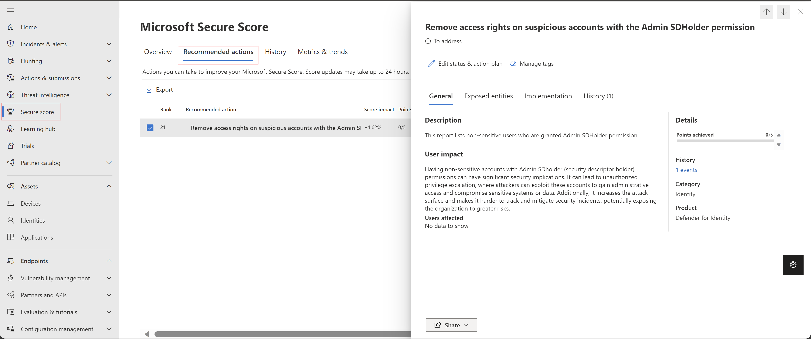

## New features added to Defender for Identity

Microsoft Defender for Identity assists Active Directory administrators in protecting their Active Directory Domain Services infrastructures from sophisticated and persistent cyber threats also known as advanced persistent threats (ATPs). Previously, this service was referred to as Azure Advanced Threat Protection (Azure ATP) and Advanced Threat Analytics (ATA).

The service operates in the cloud and relies on agents installed on Domain Controllers. These agents send signals to Microsoft's Machine Learning algorithms, enabling the detection and reporting of cyber attacks. Through its cloud-based user interface, Active Directory administrators can examine and address potential security breaches linked to advanced threats, compromised user identities, and malicious actions carried out by insiders.

Microsoft has not made any significant changes to the tool for a while. BUT it finally changed. Microsoft released a lot of new features to the Defender for Identity in July 2023 so let's go over few of them.

## What is new in Defender for Identity

Identity security posture assessments offered by Defender for Identity, which are also part of the Microsoft Secure Score proactively detect and recommend actions across your on-premises Active Directory.

### Security assessment: Do not expire passwords

The assessment indicates where users have settings for passwords that don't expire. Configuring the "Password never expires" attribute comes with potential dangers, such as compromised password security, heightened vulnerability to credential theft, and the possibility of delays in incident response and recovery.

More about this assessment here: [Security assessment: Do not expire passwords](https://learn.microsoft.com/en-us/defender-for-identity/security-assessment-do-not-expire-passwords)

### Security assessment: Remove local admins on identity assets

The assessment highlights local admins that pose a risk to your environment. Accounts with indirect control over an identity system, such as AD FS or Active Directory, hold the privileges to elevate their permissions within the system. This can ultimately result in acquiring access equivalent to that of a Domain Admin or similar high-level roles.

More about this assessment here: [Security assessment: Remove local admins on identity assets](https://learn.microsoft.com/en-us/defender-for-identity/security-assessment-remove-local-admins)

### Security assessment: Remove non-admin accounts with DCSync permissions

The assessment identifies risky DCSync permission settings. Users granted the DCSync permission are empowered to initiate domain replication, a capability that malicious actors could potentially misuse to gain entry, manipulate domain information, or undermine the stability and accessibility of your Active Directory system. It's critical for organizations to carefully manage and restrict the membership of this group. That way, you can ensure the security and integrity of the domain replication.

More about this assessment here: [Security assessment: Remove non-admin accounts with DCSync permissions](https://learn.microsoft.com/en-us/defender-for-identity/security-assessment-non-admin-accounts-dcsync)

### Security assessment: Manage accounts with passwords more than 180 days old

The assessment highlights accounts at risk because of older passwords. Passwords exceeding a 180-day lifespan amplify the potential for credentials to be stolen. Such passwords could also result in non-adherence to security standards and regulatory requirements, diminish responsibility and user awareness, and hinder the effectiveness of responding to security breaches.

More about this assessment here: [Security assessment: Security assessment: Manage accounts with passwords more than 180 days old](https://learn.microsoft.com/en-us/defender-for-identity/security-assessment-old-passwords)

### Security assessment: Remove access rights on suspicious accounts with the Admin SDHolder permission

The assessment highlights risky access rights on suspicious accounts. Having non-sensitive accounts with Admin SDHolder permissions can have significant security implications, like leading attacker to unauthorized privilege escalation or increasing the attack surface for potential breach.

More about this assessment here: [Security assessment: Remove access rights on suspicious accounts with the Admin SDHolder permission](https://learn.microsoft.com/en-us/defender-for-identity/security-assessment-remove-suspicious-access-rights)

### Security assessment: Start your Defender for Identity deployment

And now the most important assessment! This assessment encourages you to install sensors on domain controllers and other eligible servers. In the scenario where you possess a Defender for Identity license but have not yet implemented the corresponding sensors, you are not only not utilizing the services you've acquired, but you could also be overlooking potential advanced threats within your identity infrastructure.

More about this assessment here: [Security assessment: Start your Defender for Identity deployment](https://learn.microsoft.com/en-us/defender-for-identity/security-assessment-deploy-defender-for-identity)

## No more legacy Defender for Identity portal

The user interface and capabilities of the Microsoft Defender for Identity portal have been integrated into Microsoft's extended detection and response (XDR) platform, known as Microsoft 365 Defender. Starting from July 6, 2023, users who previously accessed the classic Defender for Identity portal will be automatically directed to Microsoft 365 Defender. There won't be an choice to return to the classic portal setup.

## Search displays AD groups in Microsoft 365 Defender

> This feature is still in preview

The Microsoft 365 Defender global search now allows you to search for Active Directory groups. Any groups displayed in the results is shown on a separate __Groups__ tab. If the group is selected, the search results shows more  details, including:

- Type
- Scope
- Domain
- SAM name
- SID
- Group creation time
- The first time an activity by the group was observed
- Groups that contain the selected group
- A list of all group members

## Download and schedule Defender for Identity reports

> This feature is still in preview

Microsoft 365 Defender provides Defender for Identity reports, which you can either generate on demand or configure to be sent periodically by email. This creates parity in report functionality with the classic Microsoft ATA portal.

To generate a report on demand:
1) In Microsoft 365 Defender, select __Settings__ > __Identities__ > __Report management__.
2) __Select a report__ and then select __Download__.
3) In the download report pane that appears on the right, define a time period for your report and then select __Download Report__.

Your report is then ready to be downloaded.

I do really like the tool and I would also like Microsoft to give it more love in the future. The tool has a lot of potential and it's good to see that it is actively being developed.

On that note, I'd like to end it here. If you learnt something new and you like my content, share it with your friends.

Have a wonderful day. 😊