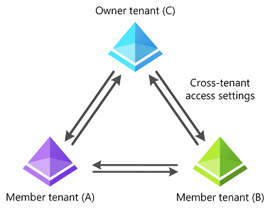
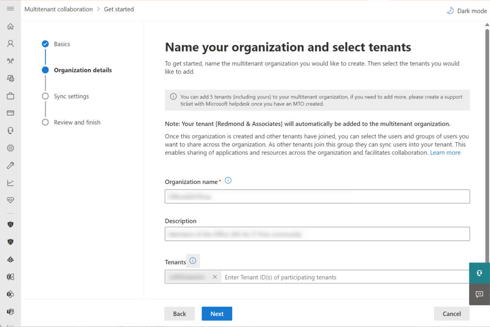
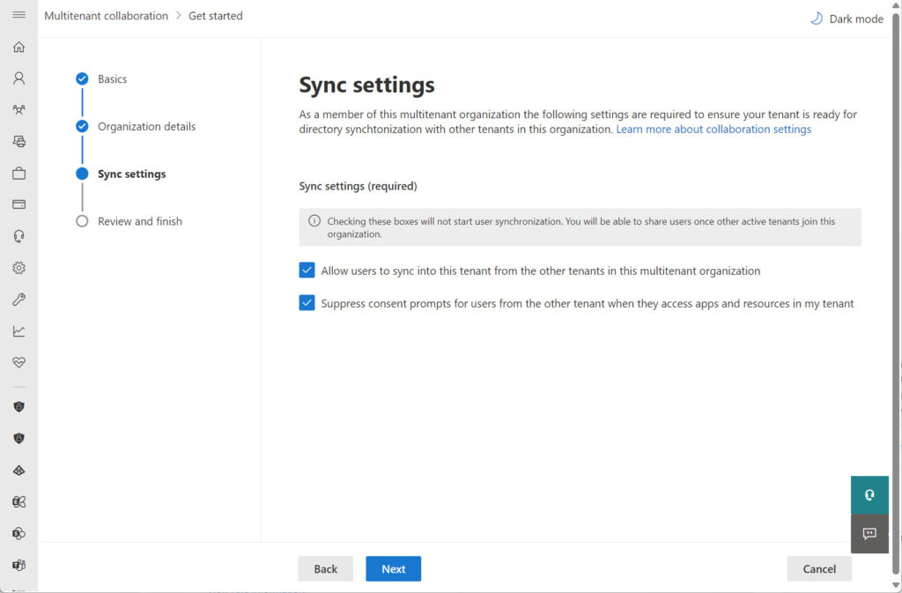
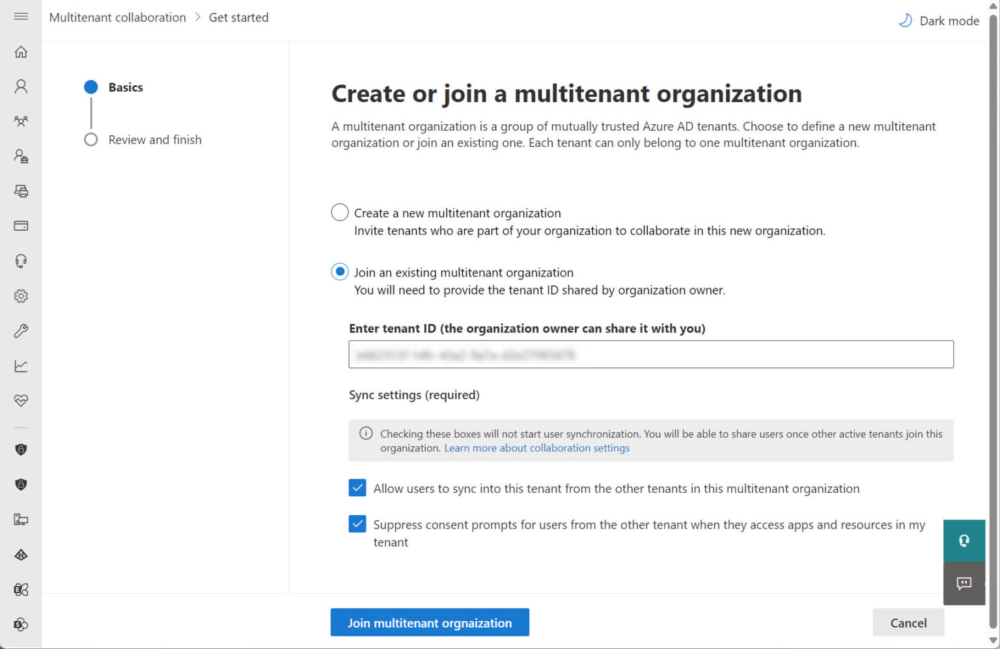
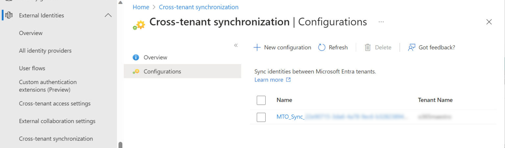

## Finally a multi-tenant concept that makes sense

In the ever-evolving landscape of Microsoft 365, staying up-to-date with the latest features is crucial. One of the recent additions that has piqued the interest of many organizations is the Multi-Tenant Organization (MTO) feature. In this article, we'll delve into the exciting world of MTO and understand how it can revolutionize collaboration between tenants.

But first, let's appreciate the work Microsoft is doing to make collaboration easier. I'm really excited about this feature. We had countless customers that had to migrate the newly acquired organization's data to their primary tenant so that the data sits under a single roof so that it can be centrally managed.

## How it came to be

Before we jump into MTO, let's take a quick look at its foundations. Microsoft introduced Azure B2B Direct Connect as a means of connecting tenants together in a trust-based arrangement. This trust is built upon Cross-Tenant Access Policies, which dictate how tenants access each other's resources. Cross-Tenant Synchronization is another vital capability that falls under these policies, ensuring the seamless synchronization of directory objects between tenants.

Now, the spotlight shines on Multi-Tenant Organizations. MTO is a new Entra ID solution, currently in PREVIEW, designed to connect up to five Entra ID tenants. These tenants are seamlessly connected via Cross-Tenant Access Policies, making directory synchronization a breeze. This feature is specifically aimed at organizations spanning multiple Microsoft 365 tenants, aiming to facilitate easier information sharing among connected tenants. In the end, it can look like this.



## Licensing

Before we get into the technical details of setting this feature up, let's talk about licenses. When MTO becomes generally available, participants will require Entra ID Premium P1 licenses. Given that this feature primarily targets enterprises, the licensing requirement is unlikely to pose a significant obstacle. Most of our customers have Microsoft 365 E3 anyway which has the required Entra ID Premium license in it.

In conclusion, Microsoft's Multi-Tenant Organization feature is poised to transform collaboration within Microsoft 365. With its foundation in trust-based policies and seamless synchronization, it's a promising step towards more efficient and integrated workflows for organizations of all sizes.

## Setting it up

Before we dive deeper into the Multi-Tenant Organization feature, it's essential to understand how to create one. MTOs are structured as follows:

- An owning tenant initiates the creation of an MTO and can only be a member of a single MTO.
- Up to four additional tenants can be added to the MTO, creating a network of interconnected organizations.
- Each tenant establishes cross-tenant synchronization configurations, enabling them to control what users from their directory synchronize with other tenants.
- There's a cap of up to 100,000 users that can synchronize from one tenant to another within the MTO.
- Tenants have the flexibility to leave an MTO at any time, and the MTO is dissolved when the owning tenant exits.

It's crucial to note that, as of now, this feature is in preview, and only tenants configured for targeted release can participate in an MTO.

### Step-by-step

To create a new MTO, follow these steps:

1) Navigate to the __Organization Settings__ section of the [Microsoft 365 admin center](https://admin.microsoft.com/Adminportal/Home#/Settings/OrganizationProfile).
2) Select the __Organization profile__ tab.
3) Choose __Multitenant collaboration__ to initiate the creation of a new MTO.



4) Provide the necessary details, including the name of the new MTO, a description, and the __tenant identifiers__ (GUIDs) for the member tenants. _Note: You can start by connecting with a single tenant._
5) Configure the synchronization settings for the connection between the owning tenant and the new member tenant. This process is akin to creating a cross-tenant synchronization configuration in the Entra ID admin center. The Microsoft 365 admin center streamlines these steps.



6) Review the configuration of the MTO on the next screen before proceeding.
7) Click the __Create multitenant organization__ button to initiate the process of populating Entra ID with the necessary properties.

> __Important:__ The administrators of each member tenant must take explicit action to join the MTO. This involves accepting an invitation from the owning tenant through the same option in the Microsoft 365 admin center.



### Setting up Entra ID

Microsoft 365 relies on the synchronized information between directories, but Entra ID provides the control for this synchronization. In the External Identities section of the Entra ID admin center, you'll find a Cross-tenant synchronization configuration. In there you'll see an established synchronization with the tenant named MTO_Sync_tenantIdentifier.



Configuration settings determine which users the tenant synchronizes with others, allowing you to add users and security groups to the configuration for synchronization. In some cases, you might need to change the synchronization setting from Manual to Automatic for certain tenants, but generally, the configuration process runs smoothly.

Remember, the MTO feature in Microsoft 365 is built upon Entra ID, making it easier to use the Share users option in the Multitenant collaboration section of the Microsoft 365 admin center to define the users your tenant is willing to synchronize with all other tenants in the MTO. Creating a security group and populating it with member accounts from the tenant, or using a dynamic security group, simplifies this process.

If you require granular control at the individual tenant level, allowing synchronization of specific users with one tenant and a different set with another, you can adjust the provisioning settings within the individual Entra ID configurations for each tenant. However, remember that the primary idea behind MTOs is to establish a common directory across all participating tenants. Therefore, the default configuration synchronizes the same users with all tenants.

## Guests vs. Members

When Entra ID takes charge of synchronizing accounts from a source tenant to a target tenant within a Multi-Tenant Organization (MTO), it does so with a unique approach. Unlike guest accounts, Entra ID creates these entries in the target tenant as member accounts. It's an intriguing distinction that becomes apparent when you examine the properties of these synchronized accounts.

``` Powershell
Id                : b662313f-bc6f-43b1-9b8b-d2e27f577a7d
DisplayName       : Martin Strnad
UserPrincipalName : martin.strnad_strnaddevsro.cz#EXT#@martinstrnad.onmicrosoft.com
Mail              : martin.strnad@strnaddevsro.cz
UserType          : Member
```

While the user principal name (UPN) of these synchronized accounts might resemble that of a guest account, what's significant is that their user type is the same as that of regular user accounts. This distinction holds the key to unlocking the potential of these synchronized accounts within MTOs.

Currently, the synchronized accounts do not influence the functionality of other Microsoft 365 applications such as Exchange, Planner, Viva Engage, or SharePoint Online. However, it's important to acknowledge that this could potentially change in the future. From the user's standpoint, these synchronized accounts resemble and can be managed just like any other regular member accounts within the environment.

## Closing thought

Could MTOs potentially replace certain tenant-to-tenant migrations, simplifying the process for some? Or will they serve as the initial step in a broader migration strategy? Only time will tell.

For me, the most interesting thing about this feature is the future impact of MTO on Microsoft 365 apps. How the Teams will work is clear, but for apps like Outlook, Viva Engage, and Planner, changes are uncertain.

With that said, I'd like to thank you for your attention and the time you've given me by reading this post. If you like it, go ahead and share it with your friends. 😊 It'll help me to reach more people.

Have a nice day.