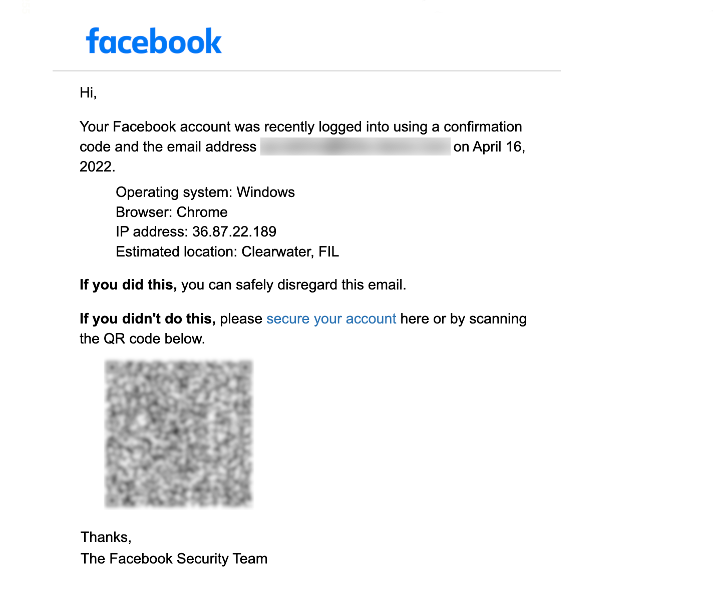
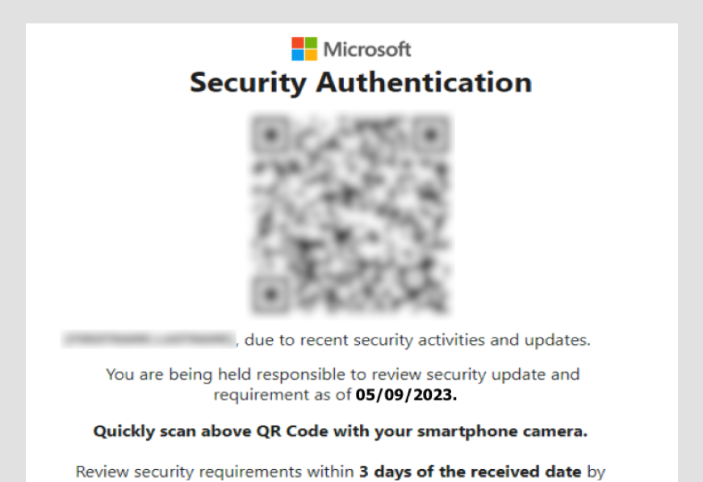

## The QR Code Phishing Phenomenon

Howdy, cyber warriors! It's been a wild ride in the tech trenches lately. I tried balancing the intricacies of my day job with a personal life and at the end I had not time to post. With that said, I'm motivated again to deliver you some interesting news. Today, let's talk about QR Code phishing, a rising star in the realm of cyber threats.

In the ever-evolving landscape of email-based attacks, QR Code phishing has emerged as the stealthy ninja, silently infiltrating inboxes and bypassing defenses. Picture this: QR code images nestled within innocent-looking emails, tempting users with cleverly disguised prompts like a password reset or a two-factor authentication request. Microsoft Defender for Office 365 has been on the front lines, adapting to the ever-shifting strategies of threat actors. Let's dive into some detail of what QR code phishing is and more importantly, how to defend your organization against it.

## What are QR Codes?
Let's kick off with the basics – what exactly is a QR code? Short for "Quick Response code," it's a two-dimensional barcode ready to be scanned by your trusty smartphone. Whether it's a website URL, contact info, or product details, QR codes are the go-to for seamless information transfer. Think of them as the digital gateway, akin to a URL.

## QR Code Phishing on the Upward Trajectory
Once a contactless convenience, QR Codes have found themselves in the dark alleys of cyber mischief. The FBI raised the alarm about cyber criminals tampering with QR codes to pilfer financial funds. Fast forward to mid-September 2023, and Microsoft's Security Research & Threat Intelligence witnessed a whopping 23% surge in phishing attempts leveraging QR codes within just one week. The game has changed, my friends.

So, why the sudden fascination with QR codes for phishing? Two words: mobility and familiarity. By redirecting attacks to users' personal mobile devices, away from the robust defenses of corporate environments, hackers exploit a potentially less secure frontier. They also tap into the most common credential theft vector – the URL.

Crafty adversaries manipulate QR codes to lead unsuspecting victims to malicious websites or prompt them to download malware, all while wearing the disguise of legitimacy. Picture this: a QR code masquerading as a message from your IT Administrator, prompting you to verify your account or download a file. The small screens of mobile devices make spotting these phishing attempts a Herculean task for users.

Defender for Office 365 has been on the lookout, dissecting various Tactics, Techniques, and Procedures (TTPs) employed by these cyber tricksters. This includes but is not limited to:
- URL redirection
- Minimal text (reducing signals for ML detection)
- Abuse of known brands
- Embedding QR codes in attachments
- Two-factor authentication and other similar prompts like document signing
- Abuse of sending infrastructure known for sending legitimate emails

Some examples bellow:

## Detecting QR Code phishing with Defender for Office 365
QR Code phishing by itself is fairly similar to credential harvesting. This is how Defender for Office 365 detects them.

### Image Detection
Advanced image extraction technologies within Defender for Office 365 detect QR codes during mail flow. The system extracts URL metadata, feeding it into threat protection and filtering capabilities. The underlying URL is then scrutinized in a sandbox environment for proactive identification and blocking of malicious threats before reaching the user's mailbox.

### Threat Signals
Defender for Office 365 takes into account many of mail flow signals – sender intelligence, message headers, recipient details, content filtering – all converging into machine learning algorithms. This dynamic context construction ensures the highest quality verdict, a shield against the QR Code Phishing onslaught.

### URL Analysis
Machine learning models dissect URLs extracted from QR codes, cross-referencing against internal and external reputation sources. For users wielding Microsoft Defender for Office 365 Plan 1/Plan 2 licenses, these URLs get sandboxed for a thorough risk assessment.

### Heuristics-based Rules
Microsoft deploys heuristic rules within Defender for Office 365, a flexible and fast-moving mitigation force. As QR Code Phishing tactics evolve, these rules adapt, ensuring a vigilant defense.

## Blocking QR Codes at scale
Let's put this into perspective:

- Over the last few months, Microsoft's heuristics-based rules blocked a staggering ~1.5 million QR code phishing attempts daily.
- Advanced detection technologies scanned more than 200 million unique URLs weekly, with over 100 million originating from QR codes.
- The tally? 18 million unique phishing emails containing QR code images blocked weekly, with around 3 million unique QR code phishing emails per day.
- QR Code phishing protection spans both commercial and consumer emails, boasting a whopping 96% success rate in the enterprise realm alone.

## What to do? Arm Yourself 🛡️
For those of you that are stepping into the unknown (Microsoft 365 security), start with the baby steps first. Implementation of Defender for Office 365 starts with an __email authentication__ like SPF, DKIM and DMARC. I already mentioned these protocols in a [separate blog post](https://martin-strnad.cz/010-email-security/). Then, use preset security policies or use recommended settings for configuring EOP and Defender for Office 365 to strengthen your security posture. After that, you should consider deploying advanced tools like those mentioned bellow.

__Defender XDR__, Microsoft's Extended Detection and Response, provides defense against QR Code Phishing. Offering end-to-end protection with unified detection, investigation, and response across endpoints, hybrid identities, email, collaboration tools, and cloud applications. By disrupting attacks early and correlating signals across products, Defender XDR limits the impact of malicious actors.

__Endpoint Protection__, specifically Microsoft Defender for Endpoint on Android and iOS, acts as the guardian against QR code phishing attacks. It not only blocks phishing sites but also fends off malware that may be downloaded and installed via URL links.

__End-User Training__, in the form of Attack Simulation Training within Defender for Office 365, empowers users to recognize and teach them how to respond to phishing attacks. Simulating real-world scenarios, this training sharpens their instincts and enhances security practices.

I hope you find my post helpful and informative. If you have further questions, do not hesitate to contact me on [Platform X](https://twitter.com/strnad10) or [LinkedIn](https://linkedin.com/in/strnad10). 😉

Until next time, have a nice day.