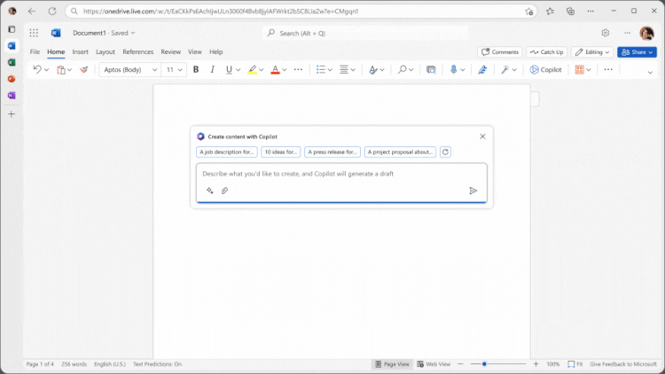

## Super-power to all, not just big businesses

Microsoft has opened up access to its AI-powered Office features, making Copilot for Microsoft 365 available to businesses of all sizes. Previously, the service required a commitment of at least 300 users and an additional cost of $9,000 for businesses. However, in response to demand from small and medium-sized businesses, Microsoft has removed the 300-seat minimum.

Divya Kumar, the global head of marketing for search and AI at Microsoft, stated, “Given the demand and interest we’ve heard from small and medium-sized businesses, we’re removing that 300 seat minimum. So now businesses of all sizes can get the $30 option and enable Copilot in Microsoft 365.”

In addition to eliminating the 300-seat purchase requirement, Microsoft is also removing the need for specific Microsoft 365 plans. Copilot is now accessible within Office apps for Office 365 E3 and E5 customers. Subscribers of Microsoft 365 Business Standard or Business Premium can also purchase Copilot for Microsoft 365 at $30 per user per month.

While Copilot for Microsoft 365 maintains a relatively high entry price, Microsoft aims to revolutionize document creation and editing within Office apps. The AI-powered assistant, driven by GPT-4 from OpenAI, functions as a chatbot in the sidebar of Microsoft 365 apps. It can also be summoned inline, allowing users to generate text in documents, create PowerPoint presentations based on Word documents, and offer assistance throughout the editing process.

## How it works

The integration of Microsoft 365 Apps, encompassing Word, Excel, PowerPoint, Outlook, Teams, and Loop, with Microsoft Copilot for Microsoft 365 aims to assist users within the specific context of their work. For instance, Copilot in Word is crafted to aid users in the creation, comprehension, and editing of documents, mirroring similar contextual support across other Microsoft 365 Apps.

Microsoft 365 Chat plays a crucial role in enabling users of Microsoft Copilot for Microsoft 365 to harness cross-app intelligence, streamlining workflows across multiple applications. Leveraging the power of foundation LLMs, a user's organizational data, and their apps, Microsoft 365 Chat generates responses. This functionality is accessible in various experiences, including Teams (chat), Bing, Microsoft Edge, and the Microsoft 365 app.

Microsoft Graph, contains information about user relationships, activities, and organizational data. The Microsoft Graph API enhances prompts with additional context derived from customer signals, incorporating information from emails, chats, documents, and meetings. For more details, refer to the Overview of Microsoft Graph and Major services and features in Microsoft Graph.

The Semantic Index for Copilot utilizes multiple LLMs positioned on top of Microsoft Graph to interpret user queries. It produces sophisticated, meaningful, and multilingual responses, enhancing productivity. This index enables quick searches through billions of vectors (mathematical representations of features or attributes), connecting users with relevant and actionable information within their organization. Further information on the Semantic Index for Copilot is available in a comprehensive video review.

In nex few weeks, I'll be playing with the new Copilot and I'll try to get as much out of it as possible. In the meantime, I hope you find my posts helpful and informative. If you have further questions, please contact me on [Platform X](https://twitter.com/strnad10) or [LinkedIn](https://linkedin.com/in/strnad10).

Until then, have a wonderful day. 👋